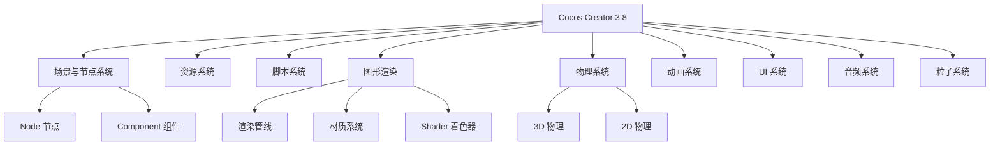

# Cocos Creator 概述

> [!abstract] 摘要
> Cocos Creator 是一款高效、轻量、免费开源的跨平台 2D & 3D 图形引擎和实时数字内容创作平台。基于组件式（ECS）架构，提供从场景编辑、脚本编写到跨平台发布的全链路开发工具。当前最新版本为 3.8 LTS。

## 核心定位

Cocos Creator 3.x 是 Cocos 引擎的当前主力版本，完全重写了底层渲染内核，支持高性能的 2D 和 3D 渲染。可用于开发游戏、车机应用、XR（VR/AR）、元宇宙等多种项目类型。

### 版本演进

| 版本 | 状态 | 说明 |
|------|------|------|
| [[Cocos Creator 2.x]] | 已停止更新（2023） | 基于 Cocos2d-x 运行时，所有能力已被 3.x 继承 |
| [[Cocos Creator 3D]] | 已合并至 3.0 | 2019 年短暂测试后合并 |
| **[[Cocos Creator 3.x]]** | **当前主力** | 全新跨平台 3D 内核，3.8 为 LTS 版本 |

> [!warning] 注意
> 2.x 和 3.x 的 API 不完全兼容。查阅文档和教程时注意区分目标版本。

## 主要特性

- **跨平台**：支持 iOS、Android、Web、Windows、Mac、各类小游戏平台
- **高性能**：全新的 3D 渲染内核，支持 PBR、阴影、后处理
- **组件式架构**：ECS (Entity-Component System) 设计，灵活组合
- **TypeScript 脚本**：完整的类型系统和编辑器集成
- **可视化编辑**：场景编辑器、动画编辑器、粒子编辑器等
- **开源免费**：无引擎使用费和分成

## 系统架构总览

Cocos Creator 3.8 由以下核心系统组成：

## 开发工作流

1. **创建项目** — 通过 Dashboard 创建空项目或模板项目
2. **场景搭建** — 在场景编辑器中创建节点、添加组件
3. **资源管理** — 导入图片、模型、音频等资源
4. **编写脚本** — 用 TypeScript 编写游戏逻辑
5. **预览调试** — 在浏览器或模拟器中实时预览
6. **构建发布** — 一键发布到目标平台

> [!tip] 从零开始
> 新手推荐从 [快速上手：制作第一个 2D 游戏](raw/getting-started/first-game-2d/index.md) 或 [快速上手：制作第一个 3D 游戏](raw/getting-started/first-game/index.md) 开始。

## v3.8 新增特性

- 程序化动画（Marionette 动画图）
- 高精度文本渲染
- 全新的可定制渲染管线
- 角色控制器（Character Controller）

## 相关页面

- [[引擎架构]]
- [[场景与节点系统]]
- [[资源系统]]
- [[图形渲染]]
- [[脚本系统]]

## 原始来源

- [raw/index.md](raw/index.md)
- [raw/getting-started/introduction/index.md](raw/getting-started/introduction/index.md)
