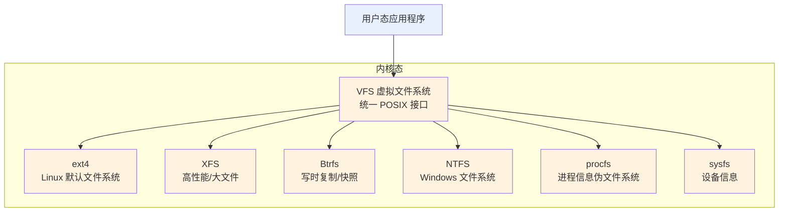

# Linux 文件系统

> [!abstract] 摘要
> Linux 文件系统是 OS 组织持久化数据的核心子系统。它奠基于两条根本哲学：(1) **"一切皆文件"**——文件、目录、设备、管道、socket 都通过统一的文件描述符接口访问，`/dev/sda` 是硬盘、`/proc/1234/status` 是进程信息、socket 是一个文件描述符整型数；(2) **VFS（虚拟文件系统）**是内核中的一个抽象层，以统一的 POSIX 接口屏蔽 ext4/XFS/Btrfs/NTFS 等具体文件系统的差异，应用程序只跟 VFS 打交道，从不直接接触底层 FS 类型。在实现层面，inode（索引节点）是文件系统的"身份证系统"——每个文件对应一个唯一的 inode，存储权限、时间戳、大小等全部元数据，并通过 12 个直接指针 + 3 级间接指针定位散落在磁盘上的数据块。FSH（文件系统层次标准）将整个目录树组织为 `/bin`、`/etc`、`/var`、`/proc`、`/dev`、`/home` 等标准目录，挂载（mount）机制允许任意文件系统挂接到统一树的任意节点上，`/etc/fstab` 记录开机自动挂载配置。理解 Linux 文件系统是理解所有上层编程语言文件 I/O 的第一性原理前提——Node.js 的 `fs.open()` 就是 `open()` 系统调用、Rust 的 `std::fs::File` 将一个裸文件描述符包装为 RAII 类型安全句柄、Cocos 资源系统的虚拟路径本质上借鉴了挂载点的设计模式。

## 根本问题

计算机需要一种方式在断电后仍然记住数据——这就是**持久化存储**的出发点。但仅把数据写到磁盘远远不够，操作系统还必须解决三个核心问题：

1. **组织**：如何在海量字节中快速找到特定文件的数据？需要一种从"文件名"到"磁盘物理位置"的映射机制。
2. **抽象**：磁盘有 ext4、XFS、NTFS、FAT32 等几十种格式，每个格式的内部结构完全不同——如何让应用程序不关心底层是哪种格式，只用 `open()`/`read()`/`write()` 就能工作？
3. **统一**：硬盘读写、键盘输入、网络数据包、进程间通信——这些看似完全不同的事物，能不能用同一套接口访问？

Linux 文件系统对这三个问题给出了精妙的答案：**inode 映射解决组织**，**VFS 解决抽象**，**"一切皆文件"解决统一**。

## 虚拟文件系统（VFS）——统一抽象层

> [!tip] 关键理解
> 用户程序从不直接与 ext4 或 XFS 交互。当你调用 `open("/home/user/note.txt")` 时，内核的 VFS 层将调用解析为对应具体文件系统操作。这就是为什么一个 Linux 系统可以同时挂载 ext4 的根分区、XFS 的 `/home`、NTFS 的外接硬盘——用户程序看到的都是同一个 `read()` 接口。



VFS 定义了一组通用操作接口（`struct file_operations`、`struct inode_operations`），每个具体文件系统实现这些接口。这体现了一个反复出现的软件工程模式——**策略与实现分离**：VFS 定义策略（"如何读取文件"的接口契约），各 FS 提供实现（"在 ext4 中具体怎么读取"）。

## "一切皆文件"——统一接口哲学

"一切皆文件"是 Linux 最根本的设计哲学之一。不同类型的数据源通过同一种抽象——文件描述符（file descriptor）——被访问：

| 对象类型 | 示例路径/操作 | 文件类型标识 |
|---------|--------------|------------|
| **普通文件** | `/home/user/note.txt` | `-`（regular file） |
| **目录** | `/etc/` | `d`（directory） |
| **块设备** | `/dev/sda`（硬盘）、`/dev/loop0` | `b`（block device） |
| **字符设备** | `/dev/tty`（终端）、`/dev/null`、`/dev/urandom` | `c`（character device） |
| **管道（FIFO）** | 通过 `mkfifo` 或 `\|` 创建 | `p`（named pipe） |
| **Unix Socket** | `/run/docker.sock` | `s`（socket） |
| **符号链接** | `/lib/systemd/systemd` → `/usr/lib/systemd/systemd` | `l`（symbolic link） |

这意味着你可以用同样的接口对不同类型对象操作：
- `ls /dev` 列出硬件设备——和 `ls /home` 列出用户文件一样
- `cat /proc/cpuinfo` 读取 CPU 信息——和 `cat note.txt` 读取文本文件一样
- `echo "hello" > /dev/null` 向黑洞设备写入——和写入普通文件一样

这本质上是一种**统一接口模式**：把异构数据源（硬盘扇区、终端输入、网络连接、进程信息）统一为字节流 + 文件描述符的抽象，极大降低了编程复杂度。这一理念被现代编程语言广泛继承——Node.js 的 Stream、Rust 的 `Read`/`Write` trait、Go 的 `io.Reader`/`io.Writer`，都是"一切皆字节流"在不同语言中的表述。

## inode ——文件的身份证

inode（index node，索引节点）是文件系统中最核心的数据结构。它是文件的元数据容器——存储除了文件名和文件数据本身之外的所有信息。

### inode 包含什么

| 属性 | 说明 |
|------|------|
| **文件类型** | 普通文件、目录、设备、pipe、socket 等 |
| **权限** | rwx × 所有者/组/其他（如 `rwxr-xr--` = 755） |
| **所有者（UID）** | 文件属于哪个用户 |
| **组（GID）** | 文件属于哪个组 |
| **硬链接数** | 有多少个文件名指向这个 inode（`ls -l` 的第 2 字段） |
| **文件大小** | 字节数 |
| **时间戳** | mtime（内容修改时间）、ctime（属性变更时间）、atime（最后访问时间） |
| **数据块指针** | 指向磁盘上实际数据块的地址（最重要！） |

> [!warning] 关键细节
> inode **不存储文件名**。文件名存储在**目录**中——目录本质上是一个"文件名 → inode 号"的映射表。这是理解硬链接的关键：多个文件名可以指向同一个 inode。

每个 inode 由一个唯一数字标识（inode 号）。查看 inode 号：

```bash
ls -li
# 140 drwxr-xr-x 2 pete pete 6 Jan 20 20:13 Desktop
# 141 drwxr-xr-x 2 pete pete 6 Jan 20 20:01 Documents
#  ↑ 第一个字段就是 inode 号
```

用 `stat` 查看完整 inode 信息：

```bash
stat ~/Desktop/
#   File: '/home/pete/Desktop/'
#   Inode: 140          Links: 2
#   Access: (0755/drwxr-xr-x)  Uid: (1000/pete)  Gid: (1000/pete)
#   Access: 2016-01-20 20:13:50    # atime
#   Modify: 2016-01-20 20:13:06    # mtime
#   Change: 2016-01-20 20:13:06    # ctime
```

### 数据块指针：12 直接 + 间接寻址

inode 的真正力量在于它的数据块寻址方案。文件数据在磁盘上可能**不连续**（碎片化）——inode 必须能定位到所有分散的块。

典型文件系统的 inode 包含 **15 个指针**：

```
前 12 个指针   → 直接指向数据块（小文件快速访问，适合 ≤48KB 的文件）
第 13 个指针   → 指向一个"间接块"，该块包含更多指向数据块的指针（一级间接）
第 14 个指针   → 指向"二级间接块"（指向多个一级间接块）
第 15 个指针   → 指向"三级间接块"（指向多个二级间接块）
```

这种分层指针结构让 inode 保持**固定大小**的同时，能处理任意大小的文件：
- 小文件（如配置文件）走直接指针，一次寻址即可访问
- 大文件（如视频）通过多级间接指针逐步定位，以寻址次数换取容量

> [!abstract] 跨领域共鸣
> inode 的间接指针方案本质上是**B-tree 的原型思想**——用多层索引管理分散存储的数据块。现代存储引擎（如 MySQL InnoDB 的 B+tree、LSM-tree）和文件系统（Btrfs 的 B-tree 元数据管理）都可以追溯到这一设计范式。这在 [[软件工程概述]] 中讨论的"数据组织结构"层面是一脉相承的。

### inode 耗尽问题

inode 在文件系统创建时预分配。虽然通常磁盘空间先用尽，但 inode 也可能耗尽的——尤其是存储大量小文件的系统。当 inode 耗尽时，即使磁盘还有空闲空间也无法创建新文件。

```bash
df -i  # 查看 inode 使用情况
```

## 硬链接与符号链接

两种链接机制实现了"一个文件、多个名字"的能力，但原理截然不同。

### 硬链接

硬链接直接在目录中创建一个新条目，指向**同一个 inode**。

```bash
ln original.txt hardlink.txt
```

- `original.txt` 和 `hardlink.txt` 共享相同的 inode 号
- 两个文件名完全平等——删除任何一个，另一个仍然可以访问数据
- 只有当链接数（link count）降为 0 时，inode 和数据才被真正删除
- **不能跨越文件系统**（因为 inode 号只在当前 FS 内唯一）
- **不能链接目录**（防止形成目录环）

### 符号链接（软链接）

符号链接是一个**独立的特殊文件**，存储指向目标文件**路径名**的文本。

```bash
ln -s original.txt symlink.txt
```

- `symlink.txt` 有自己的 inode 号（不同于目标文件）
- 在 `ls -l` 中以 `l` 开头的权限 + `->` 箭头标识
- 如果目标文件被删除，符号链接变成"悬空链接"（dangling symlink）
- **可以跨越文件系统**
- **可以链接目录**

| 特性 | 硬链接 | 符号链接 |
|------|--------|---------|
| 指向目标 | 同一个 inode | 目标文件路径名 |
| 独立 inode | 共享 | 独立 |
| 跨文件系统 | 否 | 是 |
| 链接目录 | 否 | 是 |
| 原始文件删除后 | 仍可访问 | 悬空（broken） |
| 存储开销 | 仅目录条目 | 单独 inode + 路径字符串 |

## 文件系统层次结构（FSH）

Linux 遵循**文件系统层次标准**（Filesystem Hierarchy Standard，FSH），确保所有发行版的文件组织一致且可预测。

### 根目录 `/`

所有目录和文件的起点。`ls /` 列出所有顶层目录：

### 系统核心目录

| 目录 | 用途 | 典型内容 |
|------|------|---------|
| `/bin` | 所有用户可用的基本命令 | `ls`、`cp`、`mv`、`cat`、`echo` |
| `/sbin` | 系统管理员工具（通常需 root） | `fdisk`、`mkfs`、`fsck`、`mount` |
| `/lib` | `bin/` 和 `sbin/` 中程序的基本共享库 | `libc.so`、动态链接器 |
| `/etc` | 系统和应用的配置文件（**不含**可执行文件） | 网络配置、服务配置、用户列表 |
| `/boot` | 启动所需文件 | Linux 内核镜像、GRUB 引导配置 |

### 用户与应用数据

| 目录 | 用途 | 典型内容 |
|------|------|---------|
| `/home` | 每个用户的个人目录 | 文档、配置、下载 |
| `/root` | root 用户的个人目录（独立于 `/home`） | — |
| `/usr` | 用户安装的软件和只读数据 | `/usr/bin`（非核心可执行文件）、`/usr/lib`、`/usr/local`（源码编译安装） |
| `/opt` | 第三方/可选软件包 | Google Chrome、MATLAB 等 |

### 可变与临时数据

| 目录 | 用途 | 典型内容 |
|------|------|---------|
| `/var` | "variable"——大小和内容动态变化的文件 | `/var/log`（系统日志）、缓存、数据库文件、邮件队列 |
| `/tmp` | 所有人可写的临时文件（重启后清除） | 编译中间文件、临时下载 |
| `/run` | 自启动起运行时数据（tmpfs，内存文件系统） | PID 文件、socket 文件、运行时状态 |

### 设备与伪文件系统

| 目录 | 类型 | 用途 |
|------|------|------|
| `/dev` | devtmpfs | 设备文件：`/dev/sda`（硬盘）、`/dev/tty`（终端）、`/dev/null`（黑洞）、`/dev/urandom`（随机数） |
| `/proc` | procfs（虚拟） | 进程和内核信息：`/proc/cpuinfo`、`/proc/meminfo`、`/proc/<PID>/` |
| `/sys` | sysfs（虚拟） | 内核、设备、驱动信息 |

### 挂载点

| 目录 | 用途 |
|------|------|
| `/mnt` | 手动临时挂载点 |
| `/media` | 可移动介质自动挂载（USB、CD-ROM） |

> [!tip] 记忆技巧
> `/etc` = "editable text configuration"（可编辑文本配置），`/var` = "variable"（可变的），`/opt` = "optional"（可选的）。

## 挂载 —— 将文件系统接入统一树

Linux 不像 Windows 那样给每个分区分配盘符（C:\、D:\）。相反，所有存储设备通过**挂载**（mount）操作接入到文件系统树中的某个目录。

```bash
# 创建挂载点
sudo mkdir /mydrive

# 将 ext4 文件系统挂载到该目录
sudo mount -t ext4 /dev/sdb2 /mydrive

# 之后 /mydrive 的内容就是 /dev/sdb2 分区的内容
```

### 挂载的本质

挂载点是一个普通空目录。挂载操作将该目录"覆盖"——原本目录中的内容在挂载期间不可见，直到卸载（`umount`）后才恢复。

### 使用 UUID 实现稳定挂载

内核按发现顺序分配设备名（如 `/dev/sdb2`），这个名称在重启后可能改变。UUID（通用唯一标识符）是设备不变的身份标识，适合用于持久化配置：

```bash
sudo blkid  # 查看所有设备的 UUID 和文件系统类型

# 用 UUID 挂载
sudo mount UUID=130b882f-7d79-436d-a096-1e594c92bb76 /mydrive
```

### /etc/fstab —— 开机自动挂载

`/etc/fstab`（filesystem table）定义了系统启动时自动挂载的文件系统列表。每行 6 个字段：

```
UUID=130b882f...  /          ext4  relatime,errors=remount-ro  0  1
UUID=78d203a0...  /home      xfs   relatime                    0  2
UUID=22c3d34b...  none       swap  sw                          0  0
```

| 字段 | 含义 | 示例 |
|------|------|------|
| 1. 设备标识 | UUID 或设备路径 | `UUID=130b882f...` |
| 2. 挂载点 | 目标目录路径 | `/`、`/home`、`none`（swap） |
| 3. 文件系统类型 | 必须与设备实际类型匹配 | `ext4`、`xfs`、`swap` |
| 4. 选项 | 挂载行为选项 | `defaults`、`relatime`、`noatime` |
| 5. dump | 是否被 `dump` 备份（0=忽略） | `0` |
| 6. pass | `fsck` 检查顺序（0=不检查，1=根分区先检查，2=其他） | `1`（根分区）、`2` |

> [!warning] 小心
> `/etc/fstab` 配置错误可能导致系统无法启动。修改后先用 `sudo mount -a` 测试（挂载所有 fstab 条目而不重启）。

## 文件系统类型对比

Linux 支持数十种文件系统，VFS 层让它们对用户透明。常见类型：

| 文件系统 | 特点 | 适用场景 |
|---------|------|---------|
| **ext4** | 最广泛使用的 Linux 默认 FS，支持最大 1EB 卷 / 16TB 文件，有日志 | 通用桌面和服务器 |
| **XFS** | 高性能 64 位日志 FS，大文件和并行 I/O 表现出色 | 媒体服务器、大数据存储 |
| **Btrfs** | 现代写时复制（CoW）FS，内置快照、子卷、压缩、校验和 | 需要快照和增量备份的系统 |
| **swap** | 不是文件系统，是磁盘上的交换空间，用作虚拟内存 | 物理内存不足时的补充 |
| **NTFS/FAT** | Windows 标准 FS，Linux 提供完整读写支持 | 双启动系统、外置硬盘 |
| **HFS+** | macOS 默认 FS，Linux 默认只读（可安装工具写） | 访问 Mac 硬盘 |

日志（journaling）是现代文件系统的重要特性：写入操作前先将变更记录写入日志，确保意外断电时系统能从日志快速恢复一致性状态，避免耗时的全盘 `fsck` 检查。

## 文件系统磁盘布局

每个文件系统分区由以下结构组成：

| 组件 | 位置 | 内容 |
|------|------|------|
| **引导块** | 最前几个扇区 | 操作系统引导程序（每磁盘只需一个） |
| **超级块** | 紧随引导块 | 文件系统元数据：inode 表大小、块大小、FS 总大小 |
| **inode 表** | 超级块之后 | 所有文件和目录的 inode 条目数组 |
| **数据块** | 剩余空间 | 文件和目录的实际内容 |

分区表（MBR 或 GPT）在更外层管理磁盘分区布局。MBR 限制 4 个主分区和 2TB 磁盘；GPT 是现代标准，支持大量分区和大容量磁盘。

## 跨领域连接

### → JavaScript / Node.js

Node.js 的 `fs` 模块几乎是 Linux 文件系统接口的 1:1 映射：

| Node.js API | 系统调用 | 说明 |
|------------|---------|------|
| `fs.open()` | `open(2)` | 打开文件，返回文件描述符（fd） |
| `fs.read(fd)` | `read(2)` | 从 fd 读取数据 |
| `fs.write(fd)` | `write(2)` | 向 fd 写入数据 |
| `fs.stat()` | `stat(2)` | 读取 inode 信息（权限/大小/时间戳） |
| `fs.link()` | `link(2)` | 创建硬链接 |
| `fs.symlink()` | `symlink(2)` | 创建符号链接 |
| `fs.watch()` | `inotify` | 监控文件变化（OS 事件驱动） |

当你在 Node.js 中调用 `fs.readFileSync()`，背后发生的事情是：用户态 JS → libuv 线程池 → `open()` + `read()` 系统调用 → 内核态 VFS → 具体 FS → 设备驱动 → 磁盘。理解 Linux 文件系统的层次，就能理解 Node.js 文件 I/O 的完整路径。

### → Rust

Rust 将 Linux 文件系统操作封装为类型安全的接口：

- **`std::fs::File`** ——将裸文件描述符包装为 RAII 类型，`Drop` 时自动调用 `close()`，杜绝文件描述符泄漏。
- **`std::fs::metadata()`** ——返回 `Metadata` 结构体，直接映射 inode 中的权限、大小、时间戳等字段。
- **`std::path::Path`** ——提供跨平台路径抽象，封装 `/` vs `\` 等平台差异。
- **`/proc` 自省** ——Rust 程序可以读取 `/proc/self/mem`、`/proc/self/maps` 进行运行时自省，对于性能和调试工具非常有用。
- **`OpenOptions`** ——以 builder 模式安全构造 `open()` 的标志位（`O_RDONLY`、`O_CREAT`、`O_TRUNC` 等）。

### → 软件工程

Linux 文件系统体现了多个通用软件工程原则：

1. **"一切皆文件" ≈ 统一接口原则**：把异构数据源统一为字节流抽象——这在软件设计中反复出现：Node.js Stream API、Rust `Read`/`Write` trait、HTTP Request/Response body stream、消息队列的生产/消费模型。
2. **VFS 抽象层 ≈ 策略模式（Strategy Pattern）**：VFS 定义文件操作接口，各 FS 实现——这和接口/实现分离、依赖注入是一回事。
3. **inode 间接指针模型 ≈ 存储引擎索引结构**：12 直接 + 多级间接指针本质上是 B-tree 的原型。MySQL InnoDB 的 B+tree 索引、文件系统 Btrfs 的 B-tree 元数据、LSM-tree 的多层索引——都是在解决"如何在海量数据中快速定位"这一根本问题。
4. **mount 挂载机制 ≈ 命名空间 / 虚拟文件系统设计**：挂载点的思想被 Docker 的 volume mount、K8s 的 ConfigMap/Secret 挂载、甚至 Cocos Asset Manager 的虚拟路径系统（bundles 映射到不同路径前缀）所继承。

### → Cocos Creator

Cocos Creator 的资源系统在设计上与 Linux 文件系统存在结构类比：
- **Asset Manager 的 bundle 路径映射**≈ 挂载点：每个 bundle 被映射到一个虚拟根路径，就像文件系统被挂载到一个目录节点。
- **资源 UUID → 资源实例**≈ inode 号 → 文件数据：UUID 是资源的"inode 号"，资源加载器通过 UUID 查找实际数据。
- **`resources` 目录**≈ `/usr/share`：编辑器会自动将 `resources` 下的资源打包，运行时可通过 `resources.load()` 直接加载，类似于系统共享资源目录。

## 相关页面

- [[Linux 概述]] — Linux 知识体系的入口枢纽，本页面属于其文件系统域
- [[Linux 进程模型]] — 理解 `/proc` 伪文件系统、文件描述符的跨进程继承
- [[Linux 权限体系]] — inode 权限字段（rwx × UID/GID）的深入展开
- [[Linux 网络协议栈]] — socket 作为"特殊文件"的网络侧实现
- [[软件工程概述]] — "一切皆文件"的统一接口原则、VFS 的策略模式、inode 的 B-tree 原型思想

## 原始来源

- [文件系统层次结构](raw/linuxjourney/lessons/zh/filesystem/filesystem-hierarchy.md) — FSH 标准各目录用途
- [文件系统类型](raw/linuxjourney/lessons/zh/filesystem/filesystem-types.md) — VFS 层、日志机制、ext4/XFS/Btrfs 对比
- [索引节点](raw/linuxjourney/lessons/zh/filesystem/inodes.md) — inode 结构、数据块指针、`df -i` / `stat`
- [磁盘解剖](raw/linuxjourney/lessons/zh/filesystem/anatomy-of-a-disk.md) — 分区表（MBR/GPT）、引导块/超级块/inode 表/数据块布局
- [挂载与卸载](raw/linuxjourney/lessons/zh/filesystem/mounting-and-unmounting-filesystems.md) — `mount`/`umount` 操作、UUID 稳定挂载
- [/etc/fstab](raw/linuxjourney/lessons/zh/filesystem/etc-fstab-file-system-table.md) — fstab 六字段、开机自动挂载配置
- [符号链接](raw/linuxjourney/lessons/zh/filesystem/symlinks.md) — 硬链接 vs 符号链接的 inode 行为差异
