# Linux 概述

> [!abstract] 摘要
> Linux 是理解现代计算系统的基础。它向上支撑着 JavaScript 运行时（Node.js 的事件循环依赖 OS 进程调度和 I/O 模型）、TypeScript 编译工具链、Rust 的系统编程抽象（所有权模型是对 OS 内存管理的安全封装）、Cocos Creator 的游戏引擎运行环境，以及软件工程中的服务编排、CI/CD 调度等实践。本 Wiki 将 Linux 视为整个知识体系的地基层——所有上层概念最终都运行在操作系统之上，理解 OS 原理是理解上层抽象的第一性原理前提。

## 根本问题

Linux 为什么是本 Wiki 知识体系的第一层？因为**所有软件最终都运行在操作系统上**。无论你是在浏览器中执行 JavaScript 代码、用 TypeScript 编写类型安全的游戏逻辑、用 Rust 构建零成本抽象的底层库，还是在 CI/CD 流水线中编排服务——每一项实际都依赖操作系统提供的进程管理、内存管理、文件系统和网络通信能力。

理解 Linux 不是在学"一个操作系统"，而是在学**软件运行的底层真相**——当你知道 `fork` + `execve` 如何创建进程、虚拟内存如何隔离进程空间、系统调用如何从用户态切换到内核态，你就能真正理解 JS 的事件循环为什么那样设计、Rust 的所有权为什么能保证内存安全、Docker 容器为什么能实现轻量隔离。

## 三层架构

Linux 操作系统可分为三个抽象层次：

| 层次 | 组成 | 职责 |
|------|------|------|
| **硬件层** | CPU、内存、硬盘、网卡等物理设备 | 执行计算和 I/O 操作的实际硬件 |
| **内核层** | Linux Kernel | 硬件与用户空间的桥梁——进程调度、内存管理、文件系统、设备驱动、网络协议栈、系统调用接口 |
| **用户空间** | Shell、守护进程、GUI、应用程序 | 所有用户可见的程序，通过系统调用与内核交互 |

> [!tip] 关键理解
> 内核是唯一能直接访问硬件的层。用户程序不能直接操作硬件——必须通过系统调用（syscall）从用户态切换到内核态，由内核代理执行。这种**特权级别分离**是操作系统安全性和稳定性的基石。

## Linux 知识域总览

Linux Journey 涵盖 22 个主题、186 课，可归为 7 大知识域：

```mermaid
graph TD
    A[Linux 操作系统] --> B[系统核心]
    A --> C[进程管理]
    A --> D[文件系统]
    A --> E[权限与用户]
    A --> F[网络系统]
    A --> G[系统管理]
    A --> H[文本处理]

    B --> B1["内核<br/>(架构/特权级/系统调用/模块)"]
    B --> B2["启动流程<br/>(BIOS→GRUB→内核→init)"]
    B --> B3["设备管理<br/>(/dev/sysfs/udev/dd)"]

    C --> C1["进程基础<br/>(fork/execve/状态/信号)"]
    C --> C2["进程调度<br/>(nice值/时间片/CFS)"]
    C --> C3["进程监控<br/>(top/ps/lsof/fuser)"]

    D --> D1["文件系统概念<br/>(层次结构/inode/类型/swap)"]
    D --> D2["文件系统操作<br/>(分区/挂载/fstab/磁盘使用/修复)"]
    D --> D3["链接<br/>(符号链接/硬链接)"]

    E --> E1["权限模型<br/>(rwx/所有者/组/其他)"]
    E --> E2["特殊权限<br/>(SUID/SGID/粘滞位/umask)"]
    E --> E3["用户管理<br/>(passwd/shadow/group/root)"]

    F --> F1["网络基础<br/>(OSI/TCP-IP/分层/寻址/DHCP)"]
    F --> F2["网络进阶<br/>(子网/CIDR/NAT/路由/BGP)"]
    F --> F3["网络配置<br/>(接口/路由表/NetworkManager/ARP)"]
    F --> F4["DNS<br/>(解析流程/hosts/工具)"]
    F --> F5["网络服务<br/>(rsync/NFS/Samba/HTTP)"]
    F --> F6["故障排查<br/>(ICMP/ping/traceroute/netstat/抓包)"]

    G --> G1["初始化系统<br/>(SysV/Upstart/systemd)"]
    G --> G2["包管理<br/>(仓库/dpkg/apt/rpm/yum/编译安装)"]
    G --> G3["日志系统<br/>(syslog/内核日志/认证日志/日志轮转)"]

    H --> H1["流与重定向<br/>(stdin/stdout/stderr/pipe/tee)"]
    H --> H2["文本工具<br/>(grep/sort/uniq/cut/tr/head/tail)"]
    H --> H3["编辑器<br/>(Vim/Emacs/正则表达式)"]

    classDef domain fill:#f0f4ff,stroke:#4a6fa5
    class A,B,C,D,E,F,G,H domain
```

### 系统核心

Linux 内核是理解所有上层抽象的起点。

| 子主题 | 课时 | 核心概念 |
|--------|------|----------|
| **内核概述** | 6 课 | 三层架构（硬件→内核→用户空间）、内核在资源管理中的中心角色 |
| **特权级别** | — | 用户态 vs 内核态、通过系统调用跨越特权边界 |
| **系统调用** | — | syscall 表、软件中断/陷阱、`strace` 跟踪、`fork`/`execve`/`open`/`read`/`write` |
| **内核模块** | — | `.ko` 文件、`lsmod`/`modprobe`、内核模块的动态加载与卸载 |
| **启动流程** | 5 课 | BIOS/UEFI → 引导加载程序（GRUB）→ 内核加载（initramfs）→ init 进程（PID 1） |

> [!tip] 关键概念
> **系统调用**是用户空间与内核交互的唯一合法入口。每次你打开文件、创建进程、发送网络包，背后都是一次上下文切换（用户态→内核态→用户态）。

### 进程管理

进程是 Linux 中程序的运行实例，是一切上层运行时（Node.js、浏览器、游戏引擎）的基础单元。

| 子主题 | 课时 | 核心概念 |
|--------|------|----------|
| **进程创建** | 11 课 | `fork`（克隆自身）→ `execve`（替换程序）、PID/PPID 父子关系、init（PID 1）是所有进程祖先 |
| **进程状态** | — | R（运行/就绪）、S（可中断睡眠）、D（不可中断睡眠，通常等待 I/O）、Z（僵尸——已退出但父进程未回收）、T（停止/挂起） |
| **信号** | — | 软件中断机制、SIGTERM（礼貌终止）/SIGKILL（强制杀死）/SIGINT（Ctrl+C）/SIGHUP（重载配置）、信号掩码 |
| **进程调度** | — | 时间片轮转、nice 值（-20 到 19，越低优先级越高）、CFS 完全公平调度器 |
| **进程监控** | 8 课 | `top`（实时监控）、`ps`（快照查看）、`lsof`（打开文件列表）、`fuser`（文件被谁使用）、`/proc` 虚拟文件系统 |
| **作业控制** | — | 前台/后台进程、`Ctrl+Z` 挂起、`bg`/`fg` 切换、`jobs` 列表 |

> [!warning] 注意
> **僵尸进程（Z 状态）**不会占用系统资源，但会占用进程表槽位。大量僵尸进程通常表明父进程存在 bug（未调用 `wait()` 回收子进程）。

### 文件系统

Linux 的"一切皆文件"哲学是理解系统的基础：设备是文件（`/dev/sda`），进程信息是文件（`/proc/1234/status`），网络连接也是文件（socket）。

| 子主题 | 课时 | 核心概念 |
|--------|------|----------|
| **文件系统层次结构** | 12 课 | FSH 标准：`/bin`（基本命令）、`/etc`（配置文件）、`/home`（用户目录）、`/var`（可变数据/日志）、`/tmp`（临时文件）、`/proc`（进程信息伪文件系统） |
| **inode** | — | 文件元数据（权限/所有者/大小/时间戳/数据块指针）、每个文件唯一 inode 编号、`ls -i` 查看 |
| **文件系统类型** | — | ext4（主流 Linux）、XFS（大文件）、Btrfs（写时复制/快照）、NTFS/FAT（兼容 Windows） |
| **分区与挂载** | — | 磁盘分区（MBR/GPT）、`mount`/`umount`、`/etc/fstab`（开机自动挂载） |
| **Swap 空间** | — | 磁盘模拟内存、优先使用物理内存（swappiness 控制） |
| **链接** | — | 硬链接（同一 inode，不能跨文件系统）、符号链接（独立 inode，类似快捷方式） |

### 权限与用户

Linux 多用户权限模型是系统安全的基础，其理念被容器化、云基础设施广泛继承。

| 子主题 | 课时 | 核心概念 |
|--------|------|----------|
| **基本权限** | 8 课 | r（读）、w（写）、x（执行）× 3 维度（所有者/组/其他）→ 如 `rwxr-xr--` = 755 |
| **特殊权限** | — | SUID（以文件所有者身份执行）、SGID（以组身份执行；目录内新建文件继承目录组）、粘滞位（`/tmp`，只能删除自己的文件） |
| **umask** | — | 默认权限掩码，如 umask 022 → 新建文件默认 `644`（`rw-r--r--`） |
| **用户管理** | 6 课 | `/etc/passwd`（用户列表）、`/etc/shadow`（加密密码）、`/etc/group`（组定义）、root 用户（UID 0，超级权限） |
| **进程权限** | — | 进程以用户身份运行，具备用户的文件访问权限；真实 UID vs 有效 UID |

### 网络系统

网络栈是理解分布式系统、微服务通信、Web 开发的基础。

| 子主题 | 课时 | 核心概念 |
|--------|------|----------|
| **网络基础** | 9 课 | OSI 七层模型 & TCP/IP 四层模型、应用层（HTTP/DNS）→ 传输层（TCP/UDP）→ 网络层（IP）→ 链路层（MAC/ARP） |
| **子网划分** | 7 课 | IPv4 地址结构、子网掩码、CIDR 无类别域间路由（如 `192.168.1.0/24`）、NAT 网络地址转换 |
| **路由** | 7 课 | 路由表（`ip route`）、数据包路径、路由协议（距离向量/RIP、链路状态/OSPF、BGP） |
| **网络配置** | 5 课 | 网络接口（`eth0`）、`ip addr`/`ip link`、DHCP（动态 IP 分配）、NetworkManager、ARP 协议 |
| **DNS** | 6 课 | 域名解析流程（递归查询）、DNS 记录类型（A/AAAA/CNAME/MX）、`/etc/hosts` 本地解析、`dig`/`nslookup` 工具 |
| **网络共享** | 5 课 | `rsync`（远程同步）、NFS（网络文件系统）、Samba（Windows 文件共享协议） |
| **故障排查** | 5 课 | ICMP、`ping`（连通性测试）、`traceroute`（路径追踪）、`netstat`/`ss`（连接状态）、`tcpdump`（抓包分析） |

### 系统管理

系统管理是将操作系统保持在可运行状态并高效使用软件的实践。

| 子主题 | 课时 | 核心概念 |
|--------|------|----------|
| **初始化系统** | 7 课 | SysV init（顺序启动脚本）→ Upstart（事件驱动）→ **systemd**（单元/目标并行启动，现代 Linux 默认） |
| **systemd** | — | 单元类型：`.service`（服务）、`.mount`（挂载）、`.target`（目标分组）；`systemctl` 管理命令；`graphical.target` vs `multi-user.target` |
| **包管理** | 7 课 | Debian 系（`dpkg`/`apt`/`.deb`）、RHEL 系（`rpm`/`yum`/`dnf`）、Arch 系（`pacman`）、依赖解析、软件仓库、源码编译安装 |
| **日志系统** | 6 课 | syslog 协议、`/var/log/`（syslog/内核日志/认证日志）、`journalctl`（systemd 日志）、`logrotate` 日志轮转 |

### 文本处理

文本处理是 Linux 哲学中"小工具组合"的典范——每个工具做好一件事，通过管道组合完成复杂任务。

| 子主题 | 课时 | 核心概念 |
|--------|------|----------|
| **流与重定向** | 16 课 | stdin（0）、stdout（1）、stderr（2）；`>`（重定向）、`|`（管道/pipe）、`tee`（分流） |
| **核心文本工具** | — | `grep`（模式搜索）、`sort`（排序）、`uniq`（去重）、`cut`（列截取）、`tr`（字符转换）、`head`/`tail`（头部/尾部） |
| **文本编辑器** | 13 课 | Vim（模式编辑：Normal/Insert/Visual）、Emacs（可扩展编辑器）、正则表达式（BRE/ERE） |

## 跨领域连接

Linux 作为地基，与 Wiki 中所有上层领域都存在概念依赖关系：

### Linux → JavaScript 语言

JS 运行时（Node.js、浏览器）构建在操作系统之上，其核心机制直接映射到 OS 概念：

- **事件循环** ≈ OS 进程调度 + I/O 多路复用（epoll/kqueue）：单线程主循环 + 异步 I/O 回调的分发机制
- **Worker Threads** ≈ OS 线程：`libuv` 线程池处理 CPU 密集型任务的底层实现
- **文件/网络 API** ≈ 系统调用封装：`fs.readFile()` 最终调用 `open()`/`read()`；`http.createServer()` 最终调用 `socket()`/`bind()`/`listen()`
- **进程退出码** ≈ `exit()` 系统调用：`process.exit(code)` 传递状态给父进程

### Linux → TypeScript 类型系统

TS 是 JS 的编译期类型层，与 Linux 无直接运行时关系。间接连接：

- TS 编译器的文件监控（`tsc --watch`）依赖 `inotify` 等 OS 文件系统事件
- 声明文件中的 Node.js API 类型定义本质上是对 OS 系统调用封装层的类型标注

### Linux → Rust 系统编程

Rust 与 Linux 的关系是所有上层语言中最紧密的——Rust 对 OS 概念做了**安全的编译期封装**：

- **所有权系统** ≈ 对虚拟内存和堆管理的安全抽象：借用检查器在编译期保证无悬垂指针/双重释放，编译为无 GC 的机器码
- **`unsafe` 块** ≈ 原始系统调用接口：`libc::fork()`、`mmap()` 等直接系统调用必须在 `unsafe` 中调用
- **Send/Sync trait** ≈ 对 OS 线程并发的编译期安全保证：`Send`（可跨线程传递所有权）→ `pthread` 的线程安全包装
- **文件 I/O 安全** ≈ 文件描述符生命周期管理：`File` 的 RAII 确保关闭，`OwnedFd` 防止描述符泄漏

> [!abstract] 深层共鸣
> Linux 虚拟内存的**页表隔离**和 Rust 的所有权系统解决了同一个根本问题——**如何在共享硬件的前提下实现安全隔离**。OS 用 MMU 硬件隔离进程空间；Rust 用借用规则在编译期隔离数据访问。两者殊途同归。

### Linux → Cocos Creator 引擎

Cocos 引擎最终运行在操作系统上（Web、原生 iOS/Android、桌面）：

- **Cocos 原生运行**：引擎 C++ 层直接调用 OS API（图形/音频/文件/网络）
- **进程模型**：编辑器本身是一个进程；游戏在浏览器（多进程架构）或原生 APP（单进程）中运行
- **文件路径**：资源加载路径、热更新文件写入等都依赖文件系统的路径约定

### Linux → 软件工程（横向贯通）

软件工程实践大量借鉴 Linux/Unix 的设计理念：

- **systemd 服务管理** ↔ **Docker Compose / K8s 声明式编排**：单元依赖解析 → 容器依赖管理
- **cron 定时任务** ↔ **CI/CD Pipeline 调度**：时间驱动的任务执行模式
- **Unix Pipe（`|`）** ↔ **微服务组合 / 管道路线架构**：每个工具做好一件事，通过管道组合 → 每个微服务做好一件事，通过消息队列组合
- **文件权限模型** ↔ **RBAC 访问控制**：用户/组/其他 → 角色/资源/操作的三维权限矩阵

## 相关页面

### 已存在的相关页面

- [[Jujutsu VCS]] — 本仓库使用的版本控制工具，运行在 Linux 环境
- [[Git 与版本控制]] — Git 操作底层依赖文件系统和进程模型
- [[JavaScript 教程概述]] — JS 运行时构建在 OS 之上
- [[Cocos Creator 概述]] — Cocos 引擎运行在 Linux/Windows/macOS

### 已创建的 Linux 概念页面

- [[Linux 进程模型]] — fork/execve、进程状态、信号、调度器
- [[Linux 文件系统]] — VFS、inode、FSH、链接
- [[Linux 内核架构]] — 架构、特权级分离、系统调用、内核模块
- [[Linux 网络协议栈]] — TCP/IP 四层模型、socket、sk_buff
- [[Linux 权限体系]] — rwx、SUID/SGID、粘滞位、三重 UID
- [[systemd 服务管理]] — 单元、目标、并行启动
- [[Shell 与命令行]] — 命令解释器、管道/重定向、文本处理、脚本基础
- [[Linux 包管理]] — apt/yum/dnf/pacman、依赖解析、编译安装 vs 仓库分发

## 原始来源

- [Kernel Overview](raw/linuxjourney/lessons/zh/kernel/kernel-overview.md) — 内核概述、特权级别、系统调用、模块
- [Processes](raw/linuxjourney/lessons/zh/processes/process-details.md) — 进程创建、状态、信号、优先级
- [Process Utilization](raw/linuxjourney/lessons/zh/process-utilization/tracking-processes-top.md) — 进程监控与资源使用
- [Filesystem Hierarchy](raw/linuxjourney/lessons/zh/filesystem/filesystem-hierarchy.md) — 文件系统层次结构、inode、分区、挂载
- [File Permissions](raw/linuxjourney/lessons/zh/permissions/file-permissions.md) — 文件权限、SUID/SGID、粘滞位
- [Network Basics](raw/linuxjourney/lessons/zh/network-basics/network-basics.md) — 网络基础、OSI/TCP-IP 模型
- [Subnets](raw/linuxjourney/lessons/zh/subnetting/subnets.md) — 子网划分与 CIDR
- [What is a Router](raw/linuxjourney/lessons/zh/routing/what-is-a-router.md) — 路由与路由协议
- [Network Interfaces](raw/linuxjourney/lessons/zh/network-config/network-interfaces.md) — 网络接口与配置
- [What is DNS](raw/linuxjourney/lessons/zh/dns/what-is-dns.md) — DNS 解析
- [Network File Sharing](raw/linuxjourney/lessons/zh/network-sharing/network-file-sharing.md) — 网络共享服务
- [ICMP](raw/linuxjourney/lessons/zh/troubleshooting/icmp.md) — 网络故障排查
- [systemd Overview](raw/linuxjourney/lessons/zh/init/systemd-overview.md) — 初始化系统（SysV/Upstart/systemd）
- [Boot Process Overview](raw/linuxjourney/lessons/zh/boot-system/boot-process-overview.md) — 启动流程
- [Package Management](raw/linuxjourney/lessons/zh/packages/package-management-systems.md) — 包管理系统
- [/dev Directory](raw/linuxjourney/lessons/zh/devices/dev-directory.md) — 设备管理
- [Users and Groups](raw/linuxjourney/lessons/zh/user-management/users-and-groups.md) — 用户与组管理
- [System Logging](raw/linuxjourney/lessons/zh/logging/system-logging.md) — 系统日志
- [stdout Redirection](raw/linuxjourney/lessons/zh/text-fu/stdout-standard-out-redirect.md) — 文本处理（流与重定向、核心工具）
- [Text Editors](raw/linuxjourney/lessons/zh/advanced-text-fu/text-editors-vim-or-emacs.md) — 文本编辑器与正则表达式
