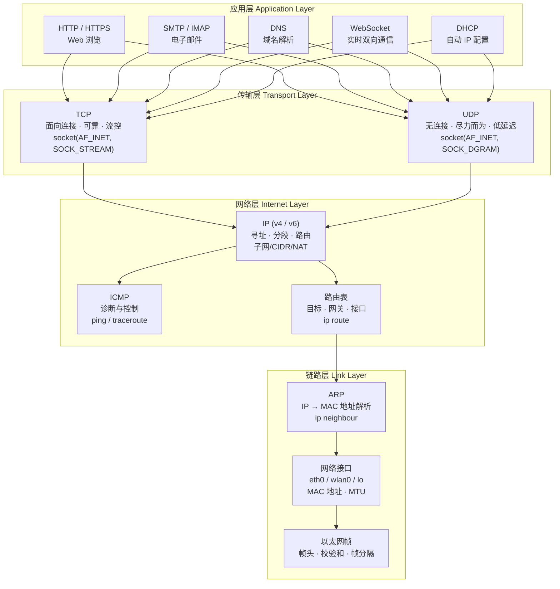

# Linux 网络协议栈

> [!abstract] 摘要
> Linux 网络协议栈是数据从应用程序内存层层封装、经过内核协议处理、通过网卡发送到物理线路，再到对端逐层解封装的完整路径。它遵循 TCP/IP 四层模型：**应用层**（用户态程序通过 socket 接口读写数据）、**传输层**（内核中 TCP/UDP 协议负责分段、流控、可靠传输）、**网络层**（IP 协议负责跨网络寻址与路由）、**链路层**（网卡驱动 + ARP 协议负责本地物理传输）。每一层添加自己的头部，对端对应层剥离头部，形成"封装—传输—解封装"的对称过程。Linux 用 `sk_buff` 结构体在协议栈各层间传递数据包，用 `net_device` 抽象网卡，用 socket 文件描述符让进程像读写文件一样收发网络数据。

## 根本问题

网络协议栈要解决的根本问题是：**如何让运行在不同主机上的进程可靠地交换数据？**这分解为四个子问题：

1. **命名与寻址**——如何唯一标识互联网上的目标进程？（IP 地址 + 端口号）
2. **路由**——数据包如何跨越多个网络找到目标？（路由表 + 路由器）
3. **可靠性**——在不稳定的物理链路上如何保证数据完整到达？（TCP 的确认、重传、流控）
4. **传输**——如何将比特流变成线路上的电信号/光信号？（网卡驱动 + 物理介质）

## TCP/IP 四层模型

OSI 七层模型是理论框架，TCP/IP 四层模型才是互联网的实际实现标准：



> 数据在协议栈中向下走时逐层加头部（封装），向上走时逐层剥头部（解封装）。应用层只关心数据内容，传输层加上端口号，网络层加上 IP 地址，链路层加上 MAC 地址——每一层都依赖下层提供的服务，同时为上层屏蔽细节。

## 各层详解

### 应用层：用户态进程与 Socket 接口

应用层是用户程序直接交互的层。Linux 中，进程通过 **socket 系统调用** 创建套接字，获得一个文件描述符（fd），之后用 `read()`/`write()` 读写网络数据——和操作文件的系统调用完全一致。这种"一切皆文件"的设计是 Unix/Linux 哲学的体现：网络 I/O 和文件 I/O 在接口层面统一，但在内核中走的是完全不同的协议栈路径。

常见的应用层协议：

| 协议 | 端口 | 用途 | 下层协议 |
|------|------|------|----------|
| HTTP/HTTPS | 80/443 | Web 浏览、REST API | TCP |
| WebSocket | 80/443（升级） | 实时双向通信 | TCP |
| SMTP | 25 | 发送邮件 | TCP |
| DNS | 53 | 域名解析 | UDP（大响应用 TCP） |
| DHCP | 67/68 | 自动 IP 配置 | UDP |

Socket 类型决定了传输层的协议选择：
- `SOCK_STREAM` → TCP（字节流、有序、可靠）
- `SOCK_DGRAM` → UDP（数据报、无连接、不可靠）
- `SOCK_RAW` → 绕过传输层，直接操作 IP 包

### 传输层：TCP 与 UDP

传输层的核心职责是 **端到端通信**：将应用数据分段，添加端口号，交给网络层寻址。端口号是 16 位整数（0-65535），其中 0-1023 为"知名端口"。

#### TCP：面向连接的可靠传输

TCP 在不可靠的 IP 层之上建立了一条 **虚拟的可靠字节流通道**。它解决的核心问题是：**如何在丢包、乱序、重复、拥塞的底层网络上，让两端感觉像是在读写一条可靠管道？**

TCP 的关键机制：

- **三次握手建立连接**：
  ```
  客户端 → SYN (seq=x) → 服务端
  客户端 ← SYN-ACK (seq=y, ack=x+1) ← 服务端
  客户端 → ACK (ack=y+1) → 服务端
  ```
  三次握手交换了双方的初始序列号，确保双方收发能力正常，并同步了连接参数。

- **四次挥手断开连接**：任一端可发起 FIN；全双工（双向独立关闭）

- **序列号与确认号**：每个字节有编号，接收方确认收到的连续字节范围。未确认的段会被重传。

- **滑动窗口与流控**：接收方通告自己的接收窗口（rwnd），发送方不能超过此窗口发送数据。这防止了快发送方淹没慢接收方。

- **拥塞控制**：发送方维护拥塞窗口（cwnd），通过慢启动、拥塞避免、快速重传、快速恢复等算法适应网络状况。TCP 的核心贡献就是：在不懂网络拓扑的情况下，通过丢包推断拥塞。

- **Keep-Alive**：长时间空闲的连接可发送探测包检测对端是否存活。

> TCP 的"可靠性"代价是延迟和开销——握手、确认、重传都需要时间。对于实时音视频、在线游戏等场景，UDP 是更好的选择。

#### UDP：无连接的尽力而为

UDP 只在 IP 上加了端口号和数据校验和，不保证到达、不保证顺序、不保证不重复。看似"简陋"，但在以下场景是最优解：

- **实时音视频**：丢几帧比等重传导致的卡顿更好
- **在线游戏**：位置更新频繁，过时的数据没有重传价值
- **DNS 查询**：单包请求-响应，TCP 握手开销太大
- **QUIC (HTTP/3 底层)**：在 UDP 之上重新实现了多路复用、TLS、流控

#### TCP 对比 UDP

| 维度 | TCP | UDP |
|------|-----|-----|
| 连接模型 | 面向连接（三次握手） | 无连接 |
| 可靠性 | 确认 + 重传 | 尽力而为 |
| 顺序 | 保证有序 | 不保证 |
| 数据边界 | 字节流（无消息边界） | 保留数据报边界 |
| 头部开销 | 20-60 字节 | 8 字节 |
| 适用场景 | Web、邮件、文件传输 | 音视频、游戏、DNS |

### 网络层：IP 寻址与路由

网络层的核心问题：**给定目标 IP 地址，数据包如何从源主机跨越多个网络到达目标？**

#### IP 寻址

IPv4 地址是 32 位（4 字节），通常写为点分十进制：`192.168.1.129`。IPv4 地址分为两部分：

- **网络部分**（网络前缀）——标识一个子网
- **主机部分**（主机标识符）——标识子网内的具体设备

IPv6 地址是 128 位（16 字节），以冒号分隔的十六进制表示：`2dde:1235:1256:3:200:f8ed:fe23:59cf`。IPv6 解决了 IPv4 地址枯竭问题，同时引入了内置的自动配置和更好的安全机制。许多系统以双栈模式同时运行 IPv4 和 IPv6。

#### 子网与子网掩码

子网掩码告诉系统：IP 地址的哪部分是网络，哪部分是主机。掩码中的 `255`（二进制全 1）"屏蔽"出网络部分。例如：

```
IP:  192.168.1.129
掩码: 255.255.255.0
网络: 192.168.1.0
主机: 129
```

同一子网内的主机可以直接通信（通过 ARP 找到对方 MAC），不同子网的主机必须经过路由器。子网划分的好处：

- **性能**：减少广播域，降低拥塞
- **安全**：子网间隔离，路由器可施加访问控制
- **管理**：将大型网络分解为可管理的逻辑单元

#### CIDR（无类别域间路由）

CIDR 用 `IP/前缀长度` 表示法替代了旧的 A/B/C 类网络划分。例如 `10.42.3.0/24` 表示前 24 位是网络前缀。可用主机数 = `2^(32-前缀长度) - 2`（减去网络地址和广播地址）。

```
/24 → 254 台主机（典型家庭/办公室网络）
/16 → 65534 台主机（大型组织）
/30 → 2 台主机（点对点链路）
```

#### NAT（网络地址转换）

NAT 是解决 IPv4 地址短缺的实用方案。路由器将私有网络（如 `192.168.x.x`）的多台设备映射到一个公共 IP 地址上。外部只能看到路由器，不知道内网拓扑。

> [!note] NAT 与 API 网关的类比
> NAT 在网络层做的事情和 API 网关在应用层做的事情在概念上是一样的：一个公共入口背后隐藏着多个内部服务，入口负责将外部请求路由到正确的内部目标。

### 链路层：MAC 地址与物理传输

链路层负责在 **同一本地网络段** 上完成实际的数据帧传输。它是唯一与硬件直接相关的层。

#### 帧与 MAC 地址

链路层将网络层传来的 IP 数据包封装成 **帧（frame）**，加上链路层头部（源/目标 MAC 地址、校验和）后交给物理层发送。接收端验证校验和，剥掉帧头，将 IP 包上传。

MAC 地址是 48 位唯一硬件标识符，出厂时固化在网卡中，格式如 `00:C4:B5:45:B2:43`。前 3 字节是 OUI（组织唯一标识符），标识制造商。

#### ARP：IP 到 MAC 的映射

主机要向本地网络上的某个 IP 发送数据时，需要知道它的 MAC 地址。ARP 协议完成这一映射：

1. 查询本地 ARP 缓存（`ip neighbour show` 查看）
2. 缓存未命中时，向网络广播 ARP 请求："谁有 IP `10.10.1.4`？"
3. 目标主机单播 ARP 应答："是我，MAC 地址是 `aa:bb:cc:dd:ee:ff`"
4. 结果加入 ARP 缓存，后续通信直接使用

如果目标 IP 不在本地网络上，主机会将帧发送给**默认网关**的 MAC 地址，由路由器继续转发。

#### Linux 网络接口

Linux 用接口名标识网卡：

| 接口 | 含义 |
|------|------|
| `eth0` | 第一个有线以太网卡 |
| `wlan0` | 第一个无线网卡 |
| `lo` | 回环接口（127.0.0.1，本机内部通信） |

管理接口的命令：`ip link show`（查看接口状态）、`ip link set eth0 up/down`（启停接口）、`ip address add 192.168.1.1/24 dev eth0`（分配 IP）。

### 路由：数据包如何找到目标

路由是网络层的核心功能。Linux 内核维护一张 **路由表**，决定每个数据包的转发路径。

查看路由表：

```
$ ip route show
default via 192.168.224.2 dev eth0         ← 默认路由（互联网出口）
192.168.224.0/24 dev eth0 proto kernel     ← 本地网络直连路由
```

路由决策逻辑：
1. 查找与目标 IP 最精确匹配的路由条目（最长前缀匹配）
2. 如果 IP 属于直连网络 → 通过 ARP 直接发送到目标 MAC
3. 如果匹配到网关路由 → 将帧发往网关 MAC，由网关继续转发
4. 如果只有默认路由匹配 → 发往默认网关（通常是 ISP 路由器）

#### 数据包的跨网络旅程

```
1. 发送方判断目标不在本地网络 → 查路由表 → 用默认网关
2. ARP 获取网关的 MAC 地址（IP 不变，MAC 改为网关的）
3. 路由器收到帧 → 剥掉帧头 → 读 IP 包头 → 查自己的路由表
4. 路由器找到下一跳 → 修改帧的源/目标 MAC → 转发
5. 重复 3-4，直到包到达目标所在的最后一路由器
6. 最后一路由器 ARP 获取目标主机的 MAC → 直接交付
```

> [!important] 关键原则
> 在整个网络旅程中，**源 IP 和目标 IP 始终不变**（NAT 除外），但**源 MAC 和目标 MAC 每跳都在改变**。IP 提供端到端寻址，MAC 提供逐跳传输。

#### 路由协议

大型网络中，路由表通过动态路由协议自动构建，而非手动配置：

- **距离矢量协议**（如 RIP）：路由器定期向邻居广播自己的路由表，通过"传闻"学习拓扑。简单但收敛慢。
- **链路状态协议**（如 OSPF）：每台路由器广播自己链路的连接状态，所有路由器独立构建全网络拓扑图。收敛快、可扩展性好。
- **BGP**：互联网骨干路由协议，在自治系统（AS）之间交换路由信息。

### DNS：域名到 IP 的解析

DNS 是互联网的 **分布式电话簿**——将人类友好的域名（`www.google.com`）转换为机器可读的 IP 地址（`216.58.192.4`）。

#### 解析过程

DNS 查询是一个漏斗式的逐级缩小过程：

```
1. 查 /etc/hosts ─→ 有则直接返回，不查 DNS
2. 递归 DNS 服务器 ─→ 通常由 ISP 提供
3. 根服务器 ─→ "去问 .com 的 TLD 服务器"
4. TLD (.com) 服务器 ─→ "去问权威名称服务器"
5. 权威名称服务器 ─→ "IP 是 216.58.192.4"
```

> [!note] DNS 与服务发现的类比
> DNS 在网络层做的事和服务注册中心（如 Consul、etcd）在微服务架构中做的事在概念上一模一样：用名称查找对应的网络地址。一个用域名查 IP，一个用服务名查 Pod/Container 地址。

#### Linux DNS 配置文件

| 文件 | 作用 |
|------|------|
| `/etc/hosts` | 本地静态主机名→IP 映射（**优先于 DNS 查询**） |
| `/etc/resolv.conf` | 指定使用的 DNS 服务器地址（`nameserver` 行） |

现代 Linux 上 `/etc/resolv.conf` 通常由 `systemd-resolved` 或 `resolvconf` 自动生成，不应手动编辑。

#### DNS 工具

- `dig www.google.com` — 详细 DNS 查询（首选诊断工具）
- `nslookup www.google.com` — 简单 DNS 查询
- `/etc/hosts` — 本地映射（开发测试常用）

### DHCP：自动网络配置

DHCP 让设备"插入即联网"，无需手动配置 IP、子网掩码、网关、DNS 服务器。

DORA 四步过程：

```
1. DISCOVER ─→ 客户端广播："网络上有 DHCP 服务器吗？"
2. OFFER    ←─ 服务器回应："用这个 IP 吧，租期 X 秒"
3. REQUEST  ─→ 客户端广播："我接受 IP YYY"
4. ACK      ←─ 服务器确认："租约生效"
```

Linux 上用 `dhclient` 命令主动请求 DHCP 分配：`sudo dhclient`。

## Linux 内核网络工具集

| 工具 | 用途 | 命令示例 |
|------|------|---------|
| `ip` | 现代网络配置（接口、路由、ARP） | `ip link show`, `ip route show`, `ip neigh` |
| `ping` | ICMP 连通性测试 | `ping -c 4 8.8.8.8` |
| `traceroute` | 追踪数据包路径 | `traceroute google.com` |
| `ss` | 查看 socket 统计（替代 `netstat`） | `ss -tlnp` |
| `tcpdump` | 抓包分析 | `tcpdump -i eth0 port 443` |
| `dig` | DNS 诊断 | `dig +short google.com` |
| `arp` / `ip neigh` | ARP 缓存 | `ip neighbour show` |
| `dhclient` | DHCP 客户端 | `sudo dhclient eth0` |
| `route` | 路由表管理（遗留） | `route -n` |

## 跨领域连接

### → JavaScript / Node.js

网络协议栈是 JavaScript 进行网络通信的底层基础：

- **`fetch()` API** 是应用层协议（HTTP）的封装——浏览器在 JS 引擎之下调用 OS 的 socket 接口，经过 TCP 三次握手、TLS 握手、HTTP 请求-响应，才将数据交给 JS 层
- **WebSocket** 运行在 TCP 之上：先通过 HTTP Upgrade 建立连接，之后在单个 TCP 连接上进行全双工消息传输。`socket.io` 库进一步在 WebSocket 之上提供了自动重连、房间、广播等抽象
- **HTTP/1.1 keep-alive**、**HTTP/2 多路复用**、**HTTP/3 (QUIC over UDP)** 是应用层协议对传输层的不同利用方式：keep-alive 复用 TCP 连接节省握手开销；HTTP/2 在单个 TCP 连接上多路复用流避免队头阻塞；HTTP/3 干脆抛弃 TCP 在 UDP 上重新造轮子
- **Node.js** 的 `net` 模块提供了原始 TCP socket（`net.createServer()`），`dgram` 模块提供了 UDP socket，这些直接对应内核的 `SOCK_STREAM` 和 `SOCK_DGRAM`
- **CORS** 是应用层的安全策略——浏览器拒绝读取跨域 HTTP 响应的内容，但数据实际上已经通过了完整的 TCP/IP 栈到达了浏览器

详见 [[JavaScript 网络请求]]。

### → Rust

- **`tokio::net`** 提供了异步 TCP/UDP socket 封装（`TcpStream`、`TcpListener`、`UdpSocket`），底层仍调用 Linux 的 `socket()` / `epoll()` / `io_uring` 等系统调用
- **借用检查器** 在网络编程中的价值：确保对 socket 缓冲区的引用在 I/O 操作进行期间不会被无效化——这是 C/C++ 中网络数据竞态的常见来源
- Rust 的所有权模型可以从协议栈的角度理解：TCP 字节流（无消息边界）不保留"所有权"边界，应用层需要自己实现消息帧协议来界定消息

详见 [[Rust 概述]]、[[所有权与借用]]。

### → Cocos Creator

- Cocos 游戏中的 **`XMLHttpRequest`/`fetch()` 网络请求**、**WebSocket 实时对战**——所有网络调用最终都经过 Linux 的网络协议栈
- 游戏对 UDP 的偏好：位置同步、动作指令等频繁小数据包用 UDP（低延迟），登陆、支付等关键操作用 TCP（可靠性）
- WebSocket 的帧格式是基于 TCP 的一个轻量应用层协议——Cocos 引擎内部的网络模块帮开发者屏蔽了 TCP 字节流的"粘包/拆包"问题

详见 [[Cocos Creator 概述]]。

### ↔ 软件工程

| 网络概念 | 软件工程类比 |
|----------|------------|
| OSI 七层模型 | **分层架构模式**——每层只依赖下层，向上层提供服务，层间通过接口通信 |
| NAT | **API 网关模式**——一个公共入口代理多个内部服务，外部只看到一个地址 |
| DNS | **服务发现模式**——用服务名解析服务地址，微服务中 Consul/Nacos 做同样的事 |
| 三次握手 | **连接建立协议**——任何可靠双向通信在开始数据交换前都需要双方确认准备就绪 |
| 链路层校验和 | **数据完整性校验**——和 HTTP 的 Content-MD5、Git 的 SHA 校验在目的上一致：检测传输中的比特错误 |

详见 [[软件工程概述]]。

## 相关页面

- [[Linux 概述]] — Linux 系统的整体入口，涵盖内核架构与子系统划分
- [[Linux 文件系统]] — socket 文件描述符与"一切皆文件"的哲学
- [[Linux 进程模型]] — 网络 I/O 如何阻塞/唤醒进程，epoll 事件驱动模型
- [[JavaScript 网络请求]] — `fetch()`、WebSocket 在应用层的使用与 HTTP 协议语义
- [[软件工程概述]] — 分层架构模式与网络协议栈的软件工程共鸣

## 原始来源

- [TCP/IP 模型](raw/linuxjourney/lessons/zh/network-basics/tcp-ip-model.md)
- [传输层](raw/linuxjourney/lessons/zh/network-basics/transport-layer.md)
- [网络层](raw/linuxjourney/lessons/zh/network-basics/network-layer.md)
- [链路层](raw/linuxjourney/lessons/zh/network-basics/link-layer.md)
- [应用层](raw/linuxjourney/lessons/zh/network-basics/application-layer.md)
- [网络寻址](raw/linuxjourney/lessons/zh/network-basics/network-addressing.md)
- [DHCP 概述](raw/linuxjourney/lessons/zh/network-basics/dhcp-overview.md)
- [IPv4](raw/linuxjourney/lessons/zh/subnetting/ipv4.md)
- [IPv6](raw/linuxjourney/lessons/zh/subnetting/ipv6.md)
- [子网](raw/linuxjourney/lessons/zh/subnetting/subnets.md)
- [CIDR](raw/linuxjourney/lessons/zh/subnetting/classless-interdomain-routing-cidr.md)
- [NAT](raw/linuxjourney/lessons/zh/subnetting/nat-network-address-translation.md)
- [什么是路由器](raw/linuxjourney/lessons/zh/routing/what-is-a-router.md)
- [路由表](raw/linuxjourney/lessons/zh/routing/routing-table.md)
- [数据包的路径](raw/linuxjourney/lessons/zh/routing/path-of-a-packet.md)
- [路由协议](raw/linuxjourney/lessons/zh/routing/routing-protocols.md)
- [网络接口](raw/linuxjourney/lessons/zh/network-config/network-interfaces.md)
- [路由（命令）](raw/linuxjourney/lessons/zh/network-config/route.md)
- [ARP 命令](raw/linuxjourney/lessons/zh/network-config/arp-command.md)
- [dhclient](raw/linuxjourney/lessons/zh/network-config/dhclient.md)
- [什么是 DNS](raw/linuxjourney/lessons/zh/dns/what-is-dns.md)
- [DNS 组件](raw/linuxjourney/lessons/zh/dns/dns-components.md)
- [DNS 过程](raw/linuxjourney/lessons/zh/dns/dns-process.md)
- [/etc/hosts](raw/linuxjourney/lessons/zh/dns/etc-hosts.md)
- [DNS 工具](raw/linuxjourney/lessons/zh/dns/dns-tools.md)
