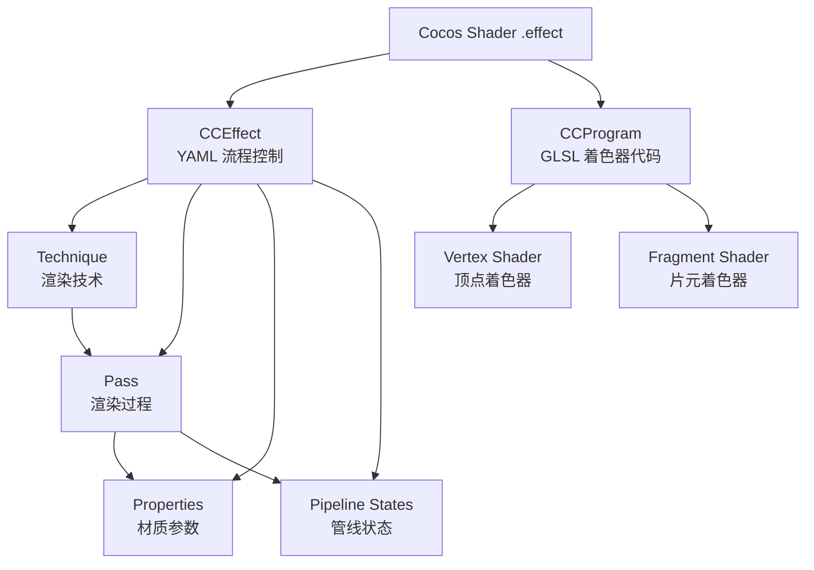

# Shader 系统

> [!abstract] 摘要
> Cocos Shader 是 Cocos Creator 基于 YAML + GLSL 的嵌入式着色器语言，通过 CCEffect（渲染流程声明）和 CCProgram（着色器代码）两部分共同构成完整的渲染流程描述。引擎提供 PBR、卡通、无光照等内置着色器，并支持 Surface Shader 和 Legacy Shader 两种编写范式，允许开发者自定义特例化渲染效果。

## 核心概念

### Cocos Shader 架构

Cocos Shader（文件扩展名 `.effect`）是一种基于 **YAML** 和 **GLSL** 的单源码嵌入式领域特定语言，整体分为两层：

1. **CCEffect 层**（YAML）：声明渲染技术（Technique）、渲染过程（Pass）、渲染状态、材质参数等流程控制信息
2. **CCProgram 层**（GLSL）：声明实际的顶点着色器（VS）和片元着色器（FS）代码片段



### 核心概念解析

- **Effect Asset**：`.effect` 文件，提供属性、宏、Shader 列表定义，被编译后注册到引擎的 ProgramLib 库中
- **Technique**：渲染技术，一个 Effect 可包含多个 Technique（如 opaque、transparent），同一材质实例只能应用其中一个
- **Pass**：渲染过程，一个 Technique 可包含多个 Pass，按定义顺序逐一执行。每个 Pass 必须包含一个 VS 和一个 FS
- **Properties**：定义 Uniform 在编辑器面板上的显示方式，支持 `target` 属性进行分量映射
- **预处理宏（Macro）**：编译时控制代码分支，所有宏默认值为 false，以 `CC_` 开头的宏不会显示在面板上

### 着色器编写范式

Cocos Creator 提供两种着色器范式：

| 范式 | 特点 | 适用场景 |
|------|------|----------|
| **Surface Shader** | 统一渲染流程、易书写维护、版本兼容性好、支持渲染调试 | 常规 PBR 材质（v3.7.2 起为默认） |
| **Legacy Shader** | 更高的定制自由度、需手动管理光照和着色运算 | 特殊渲染需求，如极度定制化的光照模型 |

Surface Shader 的代价是无法对光照和着色运算进行大幅度的定制。

## 关键细节

### CCEffect 结构

```glsl
CCEffect %{
  techniques:
  - name: opaque
    passes:
    - vert: unlit-vs:vert
      frag: unlit-fs:frag
      properties:
        mainTexture:    { value: grey }
        mainColor:      { value: [1, 1, 1, 1], linear: true, editor: { type: color } }
      depthStencilState:
        depthTest: true
        depthWrite: true
  - name: transparent
    passes:
    - vert: unlit-vs:vert
      frag: unlit-fs:frag
}%
```

### CCProgram 结构

```glsl
CCProgram unlit-vs %{
  precision highp float;
  #include <builtin/uniforms/cc-local>
  #include <builtin/uniforms/cc-global>

  vec4 vert() {
    vec4 position;
    CCVertInput(position);
    return cc_matProj * (cc_matView * matWorld) * position;
  }
}%
```

> [!warning] 入口函数
> 自定义着色器不应使用 `main` 函数。Cocos Shader 编译时自动添加 `main` 并调用 Pass 中指定的入口函数（如 `vert` 或 `frag`）。

### 预处理宏定义

宏机制的关键特性：

- 所有自定义宏默认值为 **false（0）**，运行时自动以 0 定义
- **不能使用 `#ifdef`** 判断自定义宏是否生效（结果始终为 true），应使用 `#if MACRO_NAME`
- 通过 `#pragma define-meta` 声明宏的取值范围（`range`）或选项（`options`）
- 支持函数式宏定义（WebGL 1.0 编译时自动展开）
- 材质初始化完成后宏不可修改，需修改时使用 `Material.initialize` 或 `Material.reset`

```glsl
// 互斥选项宏
#pragma define-meta FACTOR options([-3, -2, 5])

// 连续范围宏
#pragma define-meta VOLUME range([0, 3])
```

### 内置全局 Uniform

通过 `#include` 对应 Chunk 即可使用内置 Uniform：

| Chunk | 关键 Uniform | 用途 |
|-------|-------------|------|
| `cc-local` | `cc_matWorld`, `cc_matWorldIT` | 模型空间到世界空间变换 |
| `cc-global` | `cc_time`, `cc_matView`, `cc_matProj`, `cc_cameraPos`, `cc_mainLitDir` | 时间、视口、相机、主光源 |
| `cc-environment` | `cc_environment` | IBL 环境贴图 |
| `cc-forward-light` | `cc_lightPos[]`, `cc_lightColor[]` | 前向渲染光源数据 |

### 内置着色器分类

| 分类 | 目录前缀 | 说明 |
|------|---------|------|
| 管线特效 | `pipeline/` | bloom、deferred-lighting、skybox、smaa、post-process |
| 核心内置 | 根目录 | builtin-standard (PBR)、builtin-toon、builtin-unlit、builtin-terrain |
| 2D 渲染 | `for2d/` | spine、sprite 动画 |
| 粒子 | `particles/` | CPU/GPU 粒子、粒子拖尾 |
| 高级材质 | `advanced/` | 水面、皮肤、头发、玉石等 Surface Shader 材质 |
| 引擎工具 | `internal/`、`util/` | gizmo、几何体渲染、DCC 导入等 |

### 前向渲染 vs 延迟渲染

引擎统一了两种渲染管线的 Shader 架构，用户只需编写 `vs` 和 `surf` 函数，无需关心管线差异：

- **前向渲染**：`vs → fs → surf → 光照计算`
- **延迟渲染（Buffer 阶段）**：`vs → fs → surf → GBuffer`
- **延迟渲染（Lighting 阶段）**：GBuffer 还原 → 光照计算

### 创建与使用着色器

1. **编辑器创建**：资源管理器 → 新建 → 着色器（Effect）或 表面着色器（Surface Shader）
2. **代码使用**：`EffectAsset.get('builtin-standard')` 获取内置着色器，或 `resources.load` 动态加载
3. **预编译组合**：在属性检查器中配置预编译宏定义组合，避免运行时首次编译卡顿
4. **GLSL 输出**：支持 GLSL 300 ES 和 GLSL 100 两种输出，可在编辑器中切换查看

## 与其他系统的关系

- **[[图形渲染]]**：Shader 是渲染管线的核心执行单元，决定每个像素的最终颜色
- **[[材质系统]]**：Material 依赖 EffectAsset（Shader 的编译产物），通过材质设置 Uniform 和宏来控制 Shader 行为
- **[[资源系统]]**：`.effect` 文件作为资源被 Asset Manager 管理和加载

## 注意事项

> [!warning] 宏定义判断
> 使用 `#if MACRO_NAME` 而非 `#ifdef` 判断自定义宏，因为 Cocos Shader 会用默认值 0 定义所有出现的宏。

> [!warning] Uniform 内存对齐
> 引擎不支持离散声明的 `uniform` 变量，必须使用 UBO 并保持内存对齐，以避免 implicit padding。矩阵类型的 Uniform 必须是 4 阶矩阵。

> [!tip] VS Code 插件
> 推荐安装 Cocos Effect 扩展以获得 .effect 文件的语法高亮提示。

> [!tip] 动态加载路径
> 动态加载的自定义着色器成功后，effectName 为 `"../" + 文件路径`。

## 相关页面

- [[图形渲染]]
- [[材质系统]]

## 原始来源

- [着色器总览](raw/shader/index.md)
- [着色器语法](raw/shader/effect-syntax.md)
- [GLSL 语法简介](raw/shader/glsl.md)
- [着色器创建与使用](raw/shader/effect-inspector.md)
- [内置着色器](raw/shader/effect-builtin.md)
- [预处理宏定义](raw/shader/macros.md)
- [内置全局 Uniform](raw/shader/uniform.md)
- [前向渲染与延迟渲染](raw/shader/forward-and-deferred.md)
- [表面着色器](raw/shader/surface-shader.md)
- [自定义着色器](raw/shader/write-effect-overview.md)
- [Pass 可选配置参数](raw/shader/pass-parameter-list.md)
- [YAML 101 语法简介](raw/shader/yaml-101.md)
