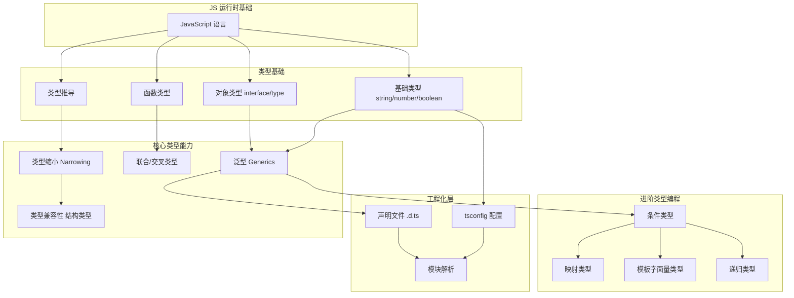

# TypeScript 概述

> [!abstract] 摘要
> TypeScript 是 JavaScript 的静态类型超集（superset），由 Microsoft 开发并开源。它在 JavaScript 之上添加了可选的静态类型系统，但**不改变 JavaScript 的运行时行为**——所有类型注解在编译时被完全擦除。TypeScript 的核心价值在于：在代码运行**之前**发现类型错误、提供精确的编辑器智能提示、并通过类型系统承载大型项目的架构设计意图。它不是一门新语言，而是让 JavaScript 变得可规模化开发的工具层。

## 根本问题

JavaScript 的动态类型在小型脚本中灵活方便，但在大型项目中带来三个核心痛点：

1. **运行时才能发现类型错误**：把 `string` 当函数调用、访问不存在的属性——这些错误只有在代码执行时才暴露
2. **代码意图不可见**：函数签名无法表达"这个参数应该是什么形状"，只能靠文档或注释
3. **重构困难**：修改一个函数签名后，无法自动检测所有受影响的调用点

TypeScript 通过**静态类型检查**解决这些问题：

```typescript
// JS: 运行时才知道错误
message(); // TypeError: message is not a function

// TS: 编译时直接报错
const message = "hello";
message();
// ~~~~~~~ This expression is not callable. Type 'String' has no call signatures.
```

TypeScript 的类型系统设计遵循一个关键原则：**尽可能利用类型推导减少显式注解，让类型系统适应用户的编码习惯，而非强迫用户适应类型系统**。这体现在：

- 类型是可选的——任何合法 JS 代码都是合法 TS 代码
- 类型推导能力强大——大多数场景无需手写类型注解
- 即使有类型错误，编译器仍然输出 JS 代码（默认行为），不阻塞开发流程
- 严格度可渐进开启——从 `any` 到处飞，到 `strict: true` 全覆盖

## TypeScript 类型系统架构

TypeScript 的类型能力是**分层叠加**的——从基础的类型注解，到表达复杂类型关系的类型级编程：



### 第一层：类型基础

这一层是 TypeScript 对 JavaScript 运行时值的直接类型化描述：

| 概念 | 说明 | 关键点 |
|------|------|--------|
| **基础类型** | `string`、`number`、`boolean`、`null`、`undefined`、`symbol`、`bigint` | JS 原语的一一对应；注意 `number` 不区分 int/float |
| **数组与元组** | `T[]` / `Array<T>` 和 `[T1, T2, ...]` | 元组是定长定序的数组类型 |
| **对象类型** | `interface`、`type`、匿名对象字面量 | 可选属性 `?`、只读属性 `readonly`、索引签名 |
| **函数类型** | 参数注解 + 返回类型 + 调用签名 | 支持重载、`this` 类型声明、Rest 参数 |
| **类型推导** | TS 自动推断变量、返回值、上下文的类型 | 最佳实践：能推导就不注解 |

### 第二层：核心类型能力

这一层是 TypeScript 区别于其他静态类型语言的核心设计：

- **结构类型系统（Structural Typing）**：类型兼容性基于**形状**而非名称。只要 `A` 拥有 `B` 所需的所有成员，`A` 就兼容 `B`——无需显式 `implements`。这天然适配 JS 中大量匿名对象字面量和函数表达式的使用模式。
  ```typescript
  interface Pet { name: string; }
  class Dog { name: string; }
  let pet: Pet = new Dog(); // OK，因为 Dog 有 name: string
  ```
- **联合类型与交叉类型**：`A | B` 表示"要么是 A 要么是 B"；`A & B` 表示"同时满足 A 和 B"。联合类型是 TypeScript 最独特的类型特性之一。
- **类型缩小（Narrowing）**：结合 JS 的控制流（`typeof`、`instanceof`、`in`、`if`/`switch`、真值检查），TS 自动在代码分支中缩窄联合类型的范围，无需手动类型转换。
- **泛型（Generics）**：类型层面的参数化——函数或类型可以接受类型变量，使得"输入类型和输出类型的关系"得以表达。`<T>(arg: T) => T` 表示"接收什么类型就返回什么类型"。

### 第三层：进阶类型编程

当项目复杂度提升，TS 的类型系统本身成为一种**类型层面的编程语言**：

- **条件类型**：`T extends U ? X : Y`，在类型层面做分支判断。与泛型配合时威力巨大（如提取 Promise 内层类型、根据输入类型变换输出类型）。
- **映射类型**：`{ [K in keyof T]: ... }`，遍历对象的键并变换其值类型。内置工具类型 `Partial<T>`、`Required<T>`、`Readonly<T>` 皆基于此。
- **模板字面量类型**（TS 4.1+）：`` `${Prefix}${string}` ``，在类型层面操作字符串字面量，实现字符串的模式匹配和转换。
- **keyof / typeof / 索引访问**：`keyof T` 获取对象类型的所有键的联合；`typeof x` 在类型上下文中提取值的类型；`T["key"]` 索引访问属性类型。这些是类型编程的"基本运算符"。

### 第四层：工程化层

类型系统的最终价值在工程实践中体现：

- **声明文件（.d.ts）**：为纯 JS 库提供类型描述，是 TypeScript 生态的基石。DefinitelyTyped（`@types/*`）社区维护了数万个库的类型定义。
- **tsconfig 配置**：通过 `tsconfig.json` 控制编译行为——`strict`（总开关）、`noImplicitAny`（禁止隐式 any）、`strictNullChecks`（null/undefined 独立类型）、`target`（编译目标 ES 版本）、`moduleResolution`（模块查找策略）等。
- **模块解析**：TypeScript 支持 ESM 和 CJS 双模块系统，通过 `moduleResolution` 控制查找策略（`node` 或 `bundler`）。`package.json` 的 `exports` 和 `types` 字段参与类型解析。

## 学习路径

推荐的 TypeScript 学习路径，由底向上渐进：

```
JavaScript 基础 → 基础类型与类型推导 → 接口与对象类型 → 联合类型与类型缩小
                                                              ↓
       条件类型 ← 泛型 ← keyof / typeof / 索引访问           函数类型与重载
           ↓                                                    ↓
       映射类型 → 模板字面量类型 → 声明文件编写 → tsconfig 精调
```

> [!tip] 学习建议
> 1. 先确保 JavaScript 基础扎实——TS 的类型系统是 JS 运行时语义的静态投影
> 2. 不要一开始就追求写出完美的泛型——从基础注解开始，让类型推导做大部分工作
> 3. 新项目一律开启 `strict: true`；旧项目渐进迁移时先开启 `noImplicitAny`
> 4. 阅读优质 `.d.ts` 文件（如 `@types/node`）是掌握进阶类型编程的捷径

## 跨领域连接

### TypeScript ← JavaScript

TypeScript 是 JavaScript 的**严格超集**：所有合法 JS 代码都是合法 TS 代码。TS 不添加新的运行时概念——类、模块、箭头函数等都来自 ES 规范。TS 的价值在于**编译期**，其类型系统对应 JS 运行时的类型语义：
- `typeof` 操作符在 TS 类型上下文和 JS 运行时各有含义
- JS 原型链 → TS 结构类型（不依赖继承链，只看形状）
- JS 闭包 → TS 泛型（类型层面的"携带上下文"）

### TypeScript → Cocos Creator

Cocos Creator 3.x 将 TypeScript 作为一等脚本语言：
- 装饰器（`@ccclass`、`@property`）将 TypeScript 类注册为引擎组件
- 泛型 `getComponent<T>()` 的类型参数确保获取到正确类型的组件
- 引擎 API 提供完整的 `.d.ts` 类型定义，编辑器智能提示覆盖所有 API
- `tsconfig.json` 可定制编译目标（通常 `es2015` 以支持 Cocos 运行环境）

详见 [[脚本系统]]、[[Cocos Creator 概述]]。

### TypeScript ↔ Rust

两门语言的类型系统都支持"类型级编程"，但思路不同：

| 维度 | TypeScript | Rust |
|------|-----------|------|
| **类型兼容** | 结构类型（看形状） | 名义类型 + trait 约束 |
| **泛型** | 运行时擦除，编译期检查 | monomorphization（零成本抽象） |
| **联合类型** | 原生 `A \| B` discriminated union | `enum` + pattern matching |
| **高级类型** | 条件类型、映射类型、模板字面量类型 | 关联类型、GAT、const generics |
| **类型安全边界** | `any` 逃生舱 | `unsafe` 块 |

两者都在"用类型系统消除运行时错误"这一点上高度一致——只是 TS 选择兼容 JS 的动态生态，Rust 选择从零构建安全保证。

### TypeScript ↔ 软件工程

TypeScript 的类型系统本身就是软件工程的实践工具：
- **类型即文档**：函数签名精确描述契约，减少沟通成本和文档维护负担
- **严格模式即编译期测试**：`strict: true` 相当于在编译期运行一套类型测试，捕获 `null` 引用、遗漏分支、隐式 any 等错误
- **重构安全**：重命名属性、修改签名后，编译器给出所有受影响位置的错误列表
- **API 契约设计**：通过 `interface` 定义模块边界，消费者和实现者共享同一份类型契约

## 相关页面

- [[JavaScript 教程概述]] — TypeScript 的前提：JavaScript 语言基础
- [[JavaScript 模块]] — JS 模块系统，TS 在此基础上提供类型级别的模块解析
- [[JavaScript 函数进阶]] — 闭包、装饰器（TS 泛型是其类型层面的对应）
- [[JavaScript 原型与继承]] — JS 原型链，与 TS 结构类型系统形成对比
- [[JavaScript 类]] — JS class 语法，TS 扩展类型注解和访问修饰符
- [[JavaScript Promise 与异步]] — Promise 类型是 TS 条件类型（Awaited）的典型应用
- [[JavaScript Generator 与迭代器]] — Generator 类型在 TS 中的声明方式
- [[脚本系统]] — Cocos Creator 使用 TypeScript 作为脚本语言，装饰器驱动
- [[Cocos Creator 概述]] — 以 TypeScript 为核心脚本语言的游戏引擎

## 原始来源

- [The TypeScript Handbook](raw/TypeScript-Website/packages/documentation/copy/en/handbook-v2/The Handbook.md)
- [The Basics](raw/TypeScript-Website/packages/documentation/copy/en/handbook-v2/Basics.md)
- [Everyday Types](raw/TypeScript-Website/packages/documentation/copy/en/handbook-v2/Everyday Types.md)
- [Narrowing](raw/TypeScript-Website/packages/documentation/copy/en/handbook-v2/Narrowing.md)
- [Type Manipulation: Generics](raw/TypeScript-Website/packages/documentation/copy/en/handbook-v2/Type Manipulation/Generics.md)
- [Type Manipulation: Conditional Types](raw/TypeScript-Website/packages/documentation/copy/en/handbook-v2/Type Manipulation/Conditional Types.md)
- [Type Compatibility](raw/TypeScript-Website/packages/documentation/copy/en/reference/Type Compatibility.md)
- [Utility Types](raw/TypeScript-Website/packages/documentation/copy/en/reference/Utility Types.md)
- [Project Configuration](raw/TypeScript-Website/packages/documentation/copy/en/project-config/tsconfig.json.md)
- [Declaration Files Introduction](raw/TypeScript-Website/packages/documentation/copy/en/declaration-files/Introduction.md)
- [Modules Reference](raw/TypeScript-Website/packages/documentation/copy/en/modules-reference/Introduction.md)
