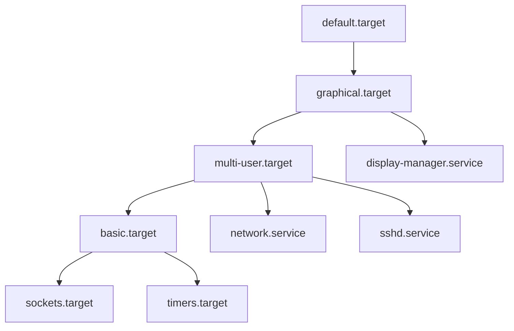

# systemd 服务管理

> [!abstract] 摘要
> systemd 是现代 Linux 的默认 init 系统和服务管理器。它是内核启动后运行的第一个用户态进程（PID 1），负责初始化系统并管理所有服务的生命周期。systemd 用「目标驱动 + 依赖解析 + 并行启动」取代了 SysV init 的顺序脚本模型：它定义了系统需要达到的目标状态（如 `graphical.target`），解析目标的所有依赖项，然后并行启动所有无依赖冲突的服务——这使启动速度从分钟级降到秒级。其核心抽象是**单元（unit）**——一种声明式配置文件，描述服务、挂载点、定时任务、socket 等系统资源。systemd 不仅是一个 init 系统，更是一套完整的系统管理工具集，涵盖了服务编排、日志管理（journald）、定时任务（timer）、设备管理、容器管理等各个方面。

## 根本问题：如何可靠地初始化和管理系统服务？

Linux 系统启动后，内核完成了硬件初始化，但它不知道要运行什么用户程序。这需要 init 进程（PID 1）来回答两个核心问题：

1. **启动顺序**：数百个系统服务（网络、SSH、数据库、Web 服务器、桌面环境）之间存在依赖关系——网络服务必须先于 SSH 启动，文件系统挂载必须先于日志服务启动。如何可靠地编排这个复杂的启动 DAG？
2. **生命周期管理**：服务可能在运行时崩溃、需要重载配置、或根据条件条件启动。如何在系统运行期间追踪和管理每个服务的状态？

## 演进：从 SysV 到 systemd

Linux 的 init 系统经历了三代演进，每一代都在解决前一版本的核心痛点：

| 特性 | SysV init | Upstart | systemd |
|------|-----------|---------|---------|
| **启动模型** | 顺序执行（A 完成 → B） | 事件驱动（事件触发作业） | 依赖解析 + 并行启动 |
| **配置格式** | Shell 脚本（命令式） | 作业配置文件 | 单元文件（声明式） |
| **服务状态追踪** | 无（PID 文件约定） | 基本（initctl） | 完整（cgroup + PID） |
| **启动速度** | 慢（串行） | 较快（事件并行） | 快（依赖并行） |
| **标准** | 传统 Unix 标准 | Ubuntu 独有 | 几乎所有现代发行版 |

### SysV init：简单但僵化

SysV init 是 Unix 传统模型。它通过 `/etc/inittab` 定义默认运行级别（runlevel 0-6），然后按 `/etc/rc.d/rc[runlevel].d/` 中 `S{数字}{服务名}` 脚本的数字顺序逐个启动服务。

```bash
# SysV 启动脚本目录示例
/etc/rc.d/rc3.d/
├── S10network    # 10: 先启网络
├── S20syslog     # 20: 再启日志
├── S30sshd       # 30: 最后启SSH
└── K05apache     # K开头：关机时执行（按顺序）
```

核心问题：**串行阻塞**。如果一个服务启动需要等待 DHCP 超时（30 秒），排在它后面的所有服务都干等着。现代系统有上百个服务，总启动时间可能长达数分钟。此外，SysV 的 PID 文件约定脆弱——如果服务崩溃而 PID 文件未清理，状态追踪就会失效。

### Upstart：事件驱动的中间形态

Upstart 由 Canonical 开发，引入事件驱动模型：服务（称为「作业」，job）在特定事件发生时启动，而非按固定顺序。例如：

```
# Upstart 作业配置
start on started network   # 当网络可用时启动
stop on runlevel [0]
```

Upstart 通过事件链实现部分并行——网络就绪后，多个依赖网络的服务可同时启动。但它的启动 DAG 是隐式的（通过事件链推断），依赖关系不够明确。随着 Ubuntu 和大多数发行版转向 systemd，Upstart 已被淘汰。

### systemd：声明式目标驱动

systemd 用**目标（target）**概念取代 SysV 的运行级别。核心思想是声明式：不描述「如何启动」每个脚本，而是声明「系统的目标状态是什么」，systemd 自行解析依赖并决定启动顺序。



与 SysV 相比，systemd 解决了三个根本问题：

1. **并行启动**：解析依赖图后，无依赖冲突的服务并行启动，显著减少启动时间
2. **按需激活**：socket 激活让 systemd 在第一个连接到达时才启动服务（而非开机就启动所有服务）；D-Bus 激活让服务在被调用时动态启动
3. **可靠进程追踪**：利用 cgroup 追踪每个服务的所有子进程（而非依赖脆弱的 PID 文件约定）

## 单元（Unit）：systemd 的基本抽象

单元是 systemd 管理的核心概念——它是一种声明式配置文件，描述系统可管理的一种资源。每个单元有特定的类型，由文件扩展名标识：

| 单元类型 | 扩展名 | 用途 |
|---------|--------|------|
| **服务单元** | `.service` | 管理系统守护进程或服务（最常用） |
| **Socket 单元** | `.socket` | 描述网络或 IPC socket，实现按需激活 |
| **定时器单元** | `.timer` | 基于时间触发的任务（cron 的替代） |
| **挂载单元** | `.mount` | 控制文件系统挂载点 |
| **目标单元** | `.target` | 将其他单元分组，作为同步点（等效于 runlevel） |
| **设备单元** | `.device` | 对应 `/sys` 中的内核设备 |
| **切片单元** | `.slice` | 通过 cgroup 对进程进行资源控制分组 |

> [!tip] 单元 vs 服务
> 初学者常把 systemd 等同于「服务管理器」，但它管理的不只是服务。挂载点、socket、定时任务、设备都是单元——systemd 是一个通用的**系统资源管理器**，服务只是其中一种资源。

### 单元文件结构

单元文件是纯文本，由多个 `[Section]` 块组成。以下是一个完整的服务单元示例：

```ini
[Unit]
Description=My Web Application
Documentation=https://example.com/docs
After=network.target postgresql.service
Requires=postgresql.service
Wants=redis.service

[Service]
Type=simple
User=www-data
Group=www-data
WorkingDirectory=/opt/myapp
ExecStart=/usr/bin/node /opt/myapp/server.js
ExecReload=/bin/kill -HUP $MAINPID
Restart=on-failure
RestartSec=5s

[Install]
WantedBy=multi-user.target
```

文件通常位于 `/etc/systemd/system/`（管理员自定义）或 `/usr/lib/systemd/system/`（发行版提供）。

#### `[Unit]` — 元数据与依赖

| 指令 | 含义 |
|------|------|
| `Description=` | 人类可读的描述文本 |
| `Documentation=` | 指向文档的 URL |
| `After=` | 指定启动顺序：本单元应在目标单元**之后**启动（不强制依赖） |
| `Before=` | 指定启动顺序：本单元应在目标单元**之前**启动 |
| `Requires=` | **强依赖**：目标单元启动失败会导致本单元也失败 |
| `Wants=` | **弱依赖**：尝试启动目标单元，但目标单元失败不影响本单元 |
| `Conflicts=` | 互斥：本单元与目标单元不能同时运行 |

> [!important] `After=` vs `Requires=` / `Wants=`
> `After=` 只控制**启动顺序**（时序），不表达依赖关系（因果）。`Requires=` 表达**依赖关系**但不指定顺序。两者通常需要**组合使用**才能获得确定性的依赖 + 时序行为。例如 `After=network.target` + `Wants=network.target` 表示「等待网络就绪后启动，但即便网络未就绪也继续」。

#### `[Service]` — 服务行为

| 指令 | 含义 | 说明 |
|------|------|------|
| `Type=` | 服务启动类型 | 决定 systemd 如何判断服务「已就绪」 |
| `ExecStart=` | 启动命令（**必填**） | 服务的入口程序 |
| `ExecStop=` | 停止命令 | 自定义停止逻辑，默认发 SIGTERM |
| `ExecReload=` | 重载命令 | `systemctl reload` 时执行 |
| `Restart=` | 重启策略 | `no` / `on-failure` / `always` / `on-abnormal` / `on-watchdog` |
| `RestartSec=` | 重启间隔 | 两次重启尝试之间等待的时间 |
| `User=` / `Group=` | 以哪个用户/组运行 | 安全最佳实践：不要用 root |
| `WorkingDirectory=` | 工作目录 | 服务进程的当前工作目录 |
| `Environment=` | 环境变量 | 设置进程环境变量 |
| `EnvironmentFile=` | 环境变量文件 | 从文件加载环境变量 |

**服务类型（Type=）详解**——这是最容易出错的配置：

| Type | systemd 判定「已就绪」的时机 | 适用场景 |
|------|---------------------------|---------|
| `simple`（默认） | ExecStart 命令启动后**立即**认为就绪 | 前台运行、不 fork 的服务（Node.js、Go 应用） |
| `forking` | 父进程退出后认为就绪（传统守护进程的 fork + exit 模式） | 传统 Unix 守护进程（如 nginx） |
| `oneshot` | 进程执行完毕退出后认为就绪 | 一次性初始化任务 |
| `notify` | 服务通过 sd_notify() 通知就绪 | 支持 systemd 通知协议的现代服务 |
| `dbus` | 服务在 D-Bus 上注册后认为就绪 | D-Bus 服务 |
| `idle` | 在所有作业完成后才启动 | 延迟到启动完成后再执行的批处理 |

> [!warning] `Type=forking` 的陷阱
> `forking` 类型要求服务 fork 一个子进程后，父进程退出。如果父进程不退出（如忘记调用 `daemon()`），systemd 会一直等待并最终超时杀死服务。现代应用（Node.js、Go、Python）通常应使用 `simple` 或 `notify`。

#### `[Install]` — 安装钩子

| 指令 | 含义 |
|------|------|
| `WantedBy=` | 被哪个 target 需要——启用时创建符号链接到该 target 的 `wants` 目录 |
| `RequiredBy=` | 类似 WantedBy 但创建 `requires` 目录的符号链接（强依赖） |
| `Alias=` | 为单元创建别名符号链接 |

`WantedBy=multi-user.target` 意味着执行 `systemctl enable` 时，systemd 会在 `/etc/systemd/system/multi-user.target.wants/` 下创建一个指向本单元文件的符号链接，确保系统启动到 `multi-user.target` 时会启动本服务。

### 单元文件的搜索路径与覆盖

systemd 按优先级从高到低搜索单元文件：

1. `/etc/systemd/system/` — 管理员手动创建或覆盖（优先级最高）
2. `/run/systemd/system/` — 运行时临时覆盖
3. `/usr/lib/systemd/system/` — 发行版/包管理器提供的默认文件

要覆盖一个单元（而非替换），在 `/etc/systemd/system/` 下创建 `<单元名>.d/` 目录，放置 `.conf` 文件：

```bash
# 覆盖 sshd.service 的 Restart 策略，不改动原始文件
/etc/systemd/system/sshd.service.d/override.conf
```

## 目标（Target）：运行级别的现代替代品

`target` 是 systemd 中最接近 SysV 运行级别概念的单元。它是一个将其他单元分组在一起的「同步点」，本身不执行任何操作。

| systemd target | SysV runlevel | 含义 |
|---------------|---------------|------|
| `poweroff.target` | 0 | 关机 |
| `rescue.target` | 1 | 单用户维护模式（最小环境） |
| `multi-user.target` | 3 | 多用户、网络就绪、无 GUI |
| `graphical.target` | 5 | 多用户、网络就绪、带 GUI |
| `reboot.target` | 6 | 重启 |

`default.target` 是一个符号链接，指向系统默认启动目标。桌面系统通常指向 `graphical.target`；服务器指向 `multi-user.target`。

```bash
# 查看当前默认目标
systemctl get-default

# 修改默认目标
sudo systemctl set-default multi-user.target

# 查看所有激活的 target
systemctl list-units --type=target
```

## systemctl：一切操作的入口

`systemctl` 是管理 systemd 单元的通用命令。以下是最核心的操作：

### 服务生命周期管理

```bash
# 立即操作
sudo systemctl start nginx.service     # 启动
sudo systemctl stop nginx.service      # 停止
sudo systemctl restart nginx.service   # 重启（stop + start）
sudo systemctl reload nginx.service    # 重载配置（不中断服务，需 ExecReload= 支持）
sudo systemctl reload-or-restart nginx.service  # 支持 reload 则 reload，否则 restart

# 持久化操作（影响下次启动）
sudo systemctl enable nginx.service    # 开机自启
sudo systemctl disable nginx.service   # 取消开机自启
sudo systemctl reenable nginx.service  # 刷新 enable 配置

# 掩码（完全禁止启动）
sudo systemctl mask nginx.service      # 符号链接到 /dev/null，无法手动启动
sudo systemctl unmask nginx.service    # 解除掩码
```

### 状态查询

```bash
systemctl status nginx.service         # 详细状态：ACTIVE/ENABLED/最近日志
systemctl is-active nginx.service      # 是否在运行
systemctl is-enabled nginx.service     # 是否开机自启
systemctl list-units                   # 列出所有活动单元
systemctl list-units --type=service    # 仅列服务
systemctl list-units --failed          # 列出失败的单元
systemctl list-unit-files              # 列出所有已安装的单元文件及启用状态
```

### 依赖分析

```bash
systemctl list-dependencies nginx.service        # 查看 nginx 依赖的所有单元
systemctl list-dependencies --reverse nginx.service  # 查看哪些单元依赖 nginx
systemctl cat nginx.service                      # 查看单元文件内容（含所有覆盖片段）
systemctl show nginx.service                     # 显示所有属性（JSON 风格）
```

### 系统级操作

```bash
sudo systemctl daemon-reload          # 重新加载所有单元文件（修改单元文件后必须执行）
sudo systemctl isolate multi-user.target  # 切换到指定 target（类似 runlevel 切换）
sudo systemctl reboot                 # 重启系统
sudo systemctl poweroff               # 关机
```

> [!warning] `daemon-reload` 是常见遗忘项
> 修改任何单元文件后，必须执行 `sudo systemctl daemon-reload` 才能让 systemd 感知到变更。没有 daemon-reload，后续的 `start`/`enable` 操作可能使用旧配置。

## journald：systemd 的日志系统

systemd 自带统一的日志系统 **journald**，与传统 syslog 有本质区别：

| 维度 | syslog | journald |
|------|--------|----------|
| **存储格式** | 纯文本文件（`/var/log/syslog`） | 二进制日志（带索引） |
| **元数据** | 有限（时间戳 + 主机名 + 进程名） | 丰富（UID/GID、cgroup、SELinux 上下文、`_SYSTEMD_UNIT` 等） |
| **查询能力** | 基本（grep/awk） | 结构化查询（`journalctl`） |
| **服务关联** | 通过进程名（脆弱） | 通过单元名（精确，`_SYSTEMD_UNIT=nginx.service`） |
| **保存位置** | `/var/log/` | 默认 `/run/log/journal/`（重启丢失）；配置后可持久化到 `/var/log/journal/` |

### journalctl 常用操作

```bash
journalctl                              # 查看所有日志（从最早开始）
journalctl -b                           # 仅本次启动的日志
journalctl -u nginx.service             # 仅 nginx 服务的日志
journalctl -u nginx.service -f          # 实时跟踪（类似 tail -f）
journalctl --since "2026-06-02 10:00"   # 时间范围过滤
journalctl --until "2026-06-02 12:00"
journalctl _PID=1234                    # 按元数据过滤
journalctl -p err                       # 按优先级过滤（emerg/alert/crit/err/warning/notice/info/debug）
journalctl -k                           # 仅内核日志（dmesg 的替代）
```

> [!tip] journald 的关键优势
> `journalctl -u nginx.service` 可以精确显示该服务的所有日志，包括 stdout/stderr 和 syslog 消息。传统 syslog 需要先猜文件名（`/var/log/nginx/error.log`? `/var/log/syslog`?），再用 grep 过滤。日志与服务单元的绑定是 systemd 最被低估的特性之一。

## 定时器（Timer）：systemd 的 cron 替代

systemd timer 是基于时间的定时任务触发机制，功能上等效 cron 但更强大：

| 特性 | cron | systemd timer |
|------|------|---------------|
| **触发精度** | 分钟级（最小粒度 1 分钟） | 秒级 |
| **依赖管理** | 无 | 可以利用 `Requires=/After=` |
| **日志记录** | 无内置（依赖邮件） | 自动集成 journald |
| **随机延迟** | 无内置 | `RandomizedDelaySec=` 避免惊群 |
| **错过执行处理** | 跳过 | `Persistent=true` 可补执行 |

定时器单元由两个文件组成：

**`mytask.service`** — 要执行的实际任务：

```ini
[Unit]
Description=My scheduled task

[Service]
Type=oneshot
ExecStart=/usr/local/bin/mytask.sh
```

**`mytask.timer`** — 触发时间表：

```ini
[Unit]
Description=Run mytask daily

[Timer]
OnCalendar=daily                # 每天一次（也可用 *-*-* 02:00:00 精确指定）
Persistent=true                 # 如果系统在触发时间关机，启动后补执行
RandomizedDelaySec=300          # 随机延迟 0-300 秒

[Install]
WantedBy=timers.target
```

```bash
# 管理定时器
sudo systemctl enable mytask.timer   # 启用定时器
sudo systemctl start mytask.timer    # 开始调度
systemctl list-timers                # 查看所有定时器及下次触发时间
```

## Socket 激活：按需启动服务

Socket 激活是 systemd 的一个精妙设计：systemd 代替服务监听 socket，当第一个连接到达时才真正启动服务。这带来三个好处：

1. **减少启动时间**：开机时不启动所有服务，只在需要时才启动
2. **减少资源占用**：空闲服务不需要常驻内存
3. **无依赖顺序要求**：即便服务尚未启动，客户端也能连接（请求被缓存在监听队列中）

工作流程：

```
1. systemd 创建 socket 并监听（.socket 单元）
2. 客户端连接到达
3. systemd 启动对应的服务（.service 单元）
4. systemd 将已建立的 socket 文件描述符传递给服务
5. 服务接手处理连接
```

**`myapp.socket`**：

```ini
[Socket]
ListenStream=8080           # 监听 TCP 8080 端口

[Install]
WantedBy=sockets.target
```

**`myapp.service`**（匹配的 service 单元）：

```ini
[Service]
ExecStart=/usr/bin/myapp
NonBlocking=true            # 服务直接使用 systemd 传递的 socket
```

> 服务名称必须匹配（`myapp.socket` 和 `myapp.service`），systemd 会自动关联。`.socket` 激活时，服务无需自己调用 `bind()`/`listen()`——systemd 已代劳。

## 跨领域连接

### → 软件工程：OS 级的服务编排器

systemd 的很多设计理念在现代软件工程实践中有直接映射：

| systemd 概念 | 软件工程对应 | 共鸣点 |
|-------------|------------|--------|
| **单元文件（声明式配置）** | Infrastructure as Code（Terraform、Ansible） | 用声明式描述期望状态，由工具自行达成 |
| `After=` / `Requires=` | Docker Compose `depends_on` | 声明服务间启动依赖关系 |
| **target 依赖图** | Kubernetes 调度（Pod 亲和性/反亲和性） | 基于依赖图的资源编排和调度 |
| **Systemd timer** | CI/CD cron 触发器（GitHub Actions `schedule`） | 时间驱动的任务执行 |
| **Socket 激活** | 懒初始化模式（Lazy Initialization） | 延迟资源分配，直到真正需要时才初始化 |
| **cgroup 进程追踪** | 容器资源隔离（cgroup + namespace） | systemd 的 cgroup 使用为容器技术奠定了基础 |
| **daemon-reload** | 配置热加载（Kubernetes ConfigMap 更新） | 修改配置后需要通知编排器重新加载 |

> [!abstract] 本质洞察
> systemd 本质上是一个**OS 层的服务编排器（service orchestrator）**——它管理服务的声明周期、解析依赖关系、按需启动、监控健康状态。Docker Compose、Kubernetes、Nomad 在更高抽象层次上做着本质上相同的事情：用声明式配置描述服务拓扑，由编排器负责达成期望状态。理解 systemd 的设计等于理解了分布式编排系统的核心思想——只是作用域从单机扩展到了集群。

### → Cocos Creator：游戏服务生命周期

游戏引擎中的「服务」（资源管理器、音频系统、渲染器、物理引擎）也需要类似 systemd 的生命周期管理：

| systemd 服务状态 | Cocos 组件/系统对应 | 说明 |
|-----------------|-------------------|------|
| **loaded** → 单元文件已加载 | 组件脚本已解析但未实例化 | 元数据就绪，尚未运行 |
| **active (running)** | 组件的 `onLoad()` / `start()` 后 | 资源已分配、事件已注册 |
| **inactive (dead)** | 组件的 `onDestroy()` 后 | 回收资源、解绑事件 |
| **Reload** | 热更新后重新加载场景/资源 | 不重启引擎的状态刷新 |
| **Socket 激活** | 资源懒加载（Lazy Asset Loading） | 延迟加载，直到用户实际需要 |

游戏引擎的「场景切换」（Scene Transition）本质上是 service 的 stop/reload/start 编排——先停旧场景的组件，卸载资源，再加载新场景的资源和组件。这和 systemd 的 `systemctl isolate`（切换到新 target）逻辑一致。

### → 系统架构设计

systemd 的声明式单元文件是「期望状态 vs 命令式步骤」哲学的经典体现：

- **SysV** 的 Shell 脚本是**命令式**的：`启动网络` → `等待` → `启日志` → `等待` → `启 SSH`
- **systemd** 的单元文件是**声明式**的：`SSH 服务需要网络.target + sshd.service`，让 systemd 自行计算执行顺序

这与现代基础设施管理（Terraform 声明「需要 3 台 EC2 实例」而非「执行 createInstance API × 3」）的逻辑一脉相承。

## 相关页面

- [[Linux 概述]] — Linux 知识体系入口，init 系统是系统管理域的核心组成部分
- [[Linux 进程模型]] — systemd 作为 PID 1，是所有用户进程的最终祖先；systemd 的 cgroup 追踪依赖于进程模型
- [[Linux 内核架构]] — 内核完成初始化后将控制权移交给 init 进程（systemd）；内核的 cgroup 子系统为 systemd 的进程分组提供基础
- [[Linux 文件系统]] — 单元文件存储于文件系统中；journald 日志持久化依赖文件系统
- [[软件工程概述]] — systemd 作为 OS 级服务编排器，其声明式配置、依赖解析、按需激活等模式与分布式编排系统共鸣

## 原始来源

- [Systemd 概述](raw/linuxjourney/lessons/zh/init/systemd-overview.md)
- [Systemd 目标](raw/linuxjourney/lessons/zh/init/systemd-goals.md)
- [SysV 概述](raw/linuxjourney/lessons/zh/init/sysv-overview.md)
- [SysV 服务](raw/linuxjourney/lessons/zh/init/sysv-services.md)
- [Upstart 概述](raw/linuxjourney/lessons/zh/init/upstart-overview.md)
- [Upstart 任务](raw/linuxjourney/lessons/zh/init/upstart-jobs.md)
- [电源状态](raw/linuxjourney/lessons/zh/init/power-states.md)
- [启动过程：Init](raw/linuxjourney/lessons/zh/boot-system/boot-process-init.md)
- [系统日志记录](raw/linuxjourney/lessons/zh/logging/system-logging.md)
- [通用日志记录](raw/linuxjourney/lessons/zh/logging/general-logging.md)
