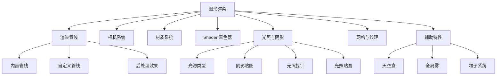

# 图形渲染

> [!abstract] 摘要
> Cocos Creator 3.8 提供了完整的图形渲染系统，包括可定制的渲染管线、PBR 材质系统、Shader 框架、光照与阴影、以及多种辅助渲染特性（天空盒、雾效、粒子等）。渲染内核完全重写，支持高性能的 2D 和 3D 混合渲染。

## 渲染子系统总览

## 渲染管线（Render Pipeline）

Cocos Creator 3.8 提供了**可定制的渲染管线**：

- **内置渲染管线**（Built-in）：开箱即用的前向渲染管线，支持 PBR
- **自定义渲染管线**：允许开发者定制渲染流程和后期效果

### 渲染流程

1. **视锥体裁剪** — 剔除不可见物体
2. **深度排序** — 不透明物体从前向后，透明物体从后向前
3. **光照计算** — 应用直接光和间接光
4. **后处理** — 应用屏幕空间效果（Bloom、色调映射等）

### 2D/3D 渲染顺序

- 2D 渲染按 `priority` 和 `sortingLayer` 排序
- 3D 渲染按不透明/透明的顺序处理
- 2D 和 3D 可以混合渲染在同一个场景中

## 相机（Camera）

Camera 组件定义了玩家的观察视角，是 3D 场景的必需元素：

- **Projection**：透视（Perspective）或正交（Orthographic）
- **Visibility**：决定哪些 Layer 的节点可见
- **Clear Flags**：控制背景清除方式（天空盒 / 纯色 / 深度）
- **FOV / OrthoHeight**：视野范围

> [!important] 清晰标记（ClearFlags）
> 多相机场景中，后续相机的 ClearFlags 通常设为 `DEPTH_ONLY` 以避免清除之前相机绘制的内容。

## 光照系统

### 光源类型

| 光源 | 说明 | 用途 |
|------|------|------|
| DirectionalLight | 平行光（太阳光） | 全局光照主光源 |
| SpotLight | 聚光灯 | 手电筒、舞台灯光 |
| SphereLight | 点光源 | 灯泡、火光 |
| Ambient | 环境光 | 场景基础亮度 |

### 阴影

- **ShadowMap**：基于深度图的实时阴影
- 支持 PCF（Percentage Closer Filtering）软阴影
- 阴影参数在光源组件上配置

### 全局光照

- **光照贴图（Lightmap）**：为静态物体预烘焙间接光照
- **光照探针（Light Probe）**：为动态物体提供间接光照信息

## 材质系统（Material）

材质定义了物体表面的渲染属性，详见 [[材质系统]]：

- 基于 Effect Asset 定义 Shader 组合
- 支持多个 Pass 实现多遍渲染
- 属性通过宏和 Uniform 控制

## 辅助渲染特性

| 特性 | 说明 |
|------|------|
| 天空盒（Skybox） | 环境背景渲染，支持 Cubemap 和程序化天空 |
| 全局雾（Fog） | 距离雾效，增强空间感 |
| 粒子系统 | GPU 驱动的粒子效果 |
| 几何体渲染器 | 调试用的线框、边界框、视锥渲染 |

## 注意事项

> [!warning] Android 平台纹理压缩
> 移动平台需要使用压缩纹理格式（ETC2 / ASTC）以节省内存和带宽。可在编辑器纹理属性中配置。

> [!tip] DrawCall 优化
> 渲染性能的关键指标是 DrawCall 数量。减少材质种类、合并网格、使用静态批处理可以有效减少 DrawCall。

## 相关页面

- [[引擎架构]]
- [[Cocos Creator 概述]]
- [[场景与节点系统]]
- [[资源系统]]
- [[材质系统]]
- [[Shader 系统]]
- [[Linux 内核架构]] — GPU 驱动运行在内核空间，Shader 编译
- [[软件工程概述]] — 管线架构模式

## 原始来源

- [raw/module-map/graphics.md](raw/module-map/graphics.md)
- [raw/render-pipeline/overview.md](raw/render-pipeline/overview.md)
- [raw/concepts/scene/light.md](raw/concepts/scene/light.md)
- [raw/material-system/overview.md](raw/material-system/overview.md)
