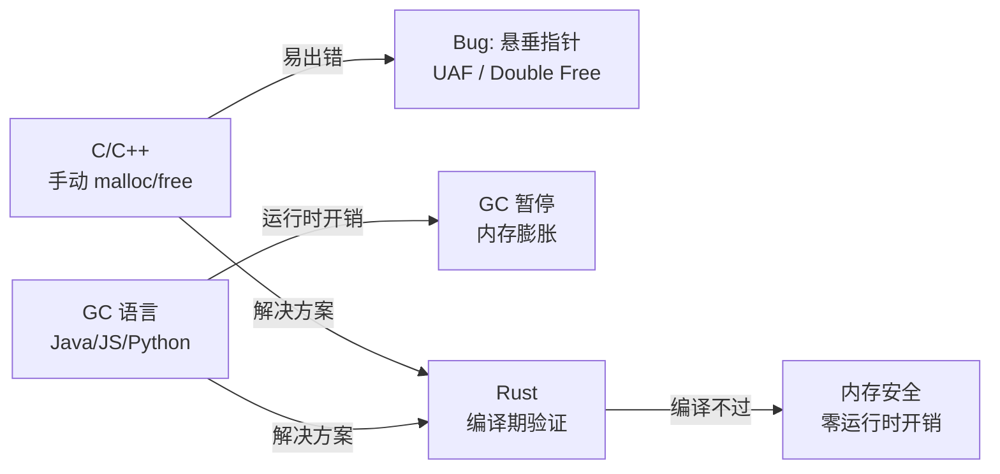

# 所有权与借用

> [!abstract] 摘要
> 所有权（Ownership）是 Rust 解决内存安全的根本方案——不依赖垃圾回收（GC），不依赖手动 `malloc`/`free`，而是通过一套**编译期静态规则**确保每个值有且仅有一个所有者，所有者在离开作用域时自动释放资源。借用（Borrowing）则让代码在不转移所有权的前提下访问数据：`&T`（共享不可变引用）和 `&mut T`（独占可变引用）由编译器在编译期验证其安全使用，消除悬垂指针、数据竞争、双重释放等内存问题。所有权不是 Rust 的"附加特性"——它是 Rust 一切设计的基础：Trait、生命周期、并发模型、闭包、智能指针，全部建立在这套规则之上。

## 根本问题：三种内存管理方案

所有程序运行时都需要管理内存。编程语言在历史上选择了三条路：

| 方案 | 代表语言 | 内存安全 | 性能 | 代价 |
|------|---------|---------|------|------|
| **手动管理** | C / C++ | 无保证 | 极高性能 | 悬垂指针、use-after-free、double free |
| **垃圾回收** | Java / Go / JS / Python | 自动安全 | 较好~较低 | GC 暂停、运行时开销、内存占用 |
| **编译期验证** | **Rust** | 自动安全 | 极高性能 | 学习曲线、编译期限制 |

C/C++ 的手动管理提供了最大控制力，但"为每个 `malloc` 配对一个 `free`"在大型项目中极易出错——忘记释放导致内存泄漏，过早释放导致 use-after-free，重复释放导致 double free。这不仅是 bug，更是安全漏洞的来源。

GC 语言用运行时追踪解决了安全问题，但代价是运行时开销：GC 暂停会卡顿应用，垃圾收集器本身消耗 CPU 和内存，且开发者失去了对内存布局和释放时机的精确控制。

**Rust 的答案**：把"谁拥有内存、内存何时释放"的问题从运行时提前到编译期。编译器在代码运行前就完整验证所有内存操作的正确性——如果违反规则，代码根本编译不过。这种验证**零运行时开销**，因为所有检查都在编译期完成，生成的机器码没有任何额外的内存管理指令。



## 栈与堆：Rust 的内存布局

在深入所有权规则之前，必须先理解数据存在哪里——这直接决定了所有权规则的行为差异。

**栈（Stack）**：按后进先出（LIFO）顺序管理数据。数据大小必须在编译期已知且固定，入栈出栈极快（只需移动栈顶指针）。函数调用时，参数和局部变量被压入栈；函数返回时自动弹出。

**堆（Heap）**：用于存储编译期大小未知或可能变化的数据。分配时需要内存分配器在堆中找到足够大的空闲空间，返回指向该空间的指针。指针本身大小固定，存在栈上；实际数据在堆上。访问堆数据比访问栈数据慢（需通过指针间接访问）。

> [!tip] 关键理解
> 所有权的核心目的就是管理**堆数据**。栈上的数据随函数作用域自然释放，不需要所有权系统介入。Rust 的所有权规则真正管的是"堆上的数据属于谁"和"什么时候释放堆上的数据"。

```rust
// 栈上数据：大小固定，自动复制
let x = 5;          // i32 整个存在栈上
let y = x;          // 整个 5 被复制到 y 的栈位置，x 仍然有效

// 堆上数据：String 的指针/长度/容量在栈上，实际内容在堆上
let s1 = String::from("hello");  // 栈: {ptr, len, cap} → 堆: "hello"
let s2 = s1;                      // s1 的栈数据被复制给 s2，但 s1 不再有效！
// println!("{s1}");              // 编译错误：s1 已被移动
```

## 三大所有权规则

Rust 的所有权系统基于三条严格规则：

> 1. Rust 中的每一个值都有一个**所有者**（owner）。
> 2. 值在任一时刻有且只有一个所有者。
> 3. 当所有者离开作用域，这个值将被丢弃（自动调用 `drop`）。

这三条规则由编译器在编译期强制执行。违反任何一条，编译失败。

```rust
{                        // s 尚未声明，不存在
    let s = String::from("hello");  // s 进入作用域，是 "hello" 的所有者
    // s 在这里有效
}                        // s 离开作用域，编译器自动调用 drop
                         // "hello" 的堆内存被释放
```

这跟 C++ 的 RAII（Resource Acquisition Is Initialization）理念一致——值在创建时获取资源，在离开作用域时释放。区别在于：C++ 的 RAII 依赖程序员正确实现，Rust 的 RAII 由编译器强制执行。

## Move 语义：所有权转移

当把堆上数据赋给另一个变量时，Rust 执行**移动（Move）**而非浅拷贝：

```rust
let s1 = String::from("hello");
let s2 = s1;             // s1 被移动到 s2，s1 失效

// println!("{s1}");     // 编译错误：value borrowed here after move
println!("{s2}");        // 正常：s2 是当前所有者
```

底层发生了什么：

1. `String` 在栈上存储三个字段：指向堆内存的**指针**、**长度**（已使用字节数）、**容量**（分配的字节数）
2. `let s2 = s1;` 将 s1 的栈数据（指针、长度、容量）复制到 s2——**不复制堆数据**
3. Rust 同时**令 s1 失效**——编译器后续禁止使用 s1
4. 当 s2 离开作用域，它释放堆内存；s1 离开作用域时什么都不做（它已失效）

这避免了 double free：如果 s1 和 s2 都认为自己拥有堆数据，两者离开作用域时会尝试释放同一块内存两次。

> Rust 永远**不**自动创建数据的深拷贝。任何自动复制都是代价极小的栈数据复制。

### 移动发生在多种场景

```rust
let s = String::from("hello");

// 赋给新变量 → 移动
let s2 = s;

// 传给函数 → 移动
fn take(s: String) { /* s 被移入函数 */ }
take(s2);
// println!("{s2}"); // 编译错误

// 函数返回 → 移动
fn give() -> String {
    let s = String::from("world");
    s  // 所有权移出函数
}

// 模式匹配 → 移动（枚举解构时）
// 循环绑定 → 移动（for x in vec 消费 vec）
```

### 赋值替换也会触发 drop

```rust
let mut s = String::from("hello");
s = String::from("ahoy");  // 新值赋给 s
                           // "hello" 的堆内存在此刻被立即释放
                           // 因为 "hello" 的所有者 s 被新值覆盖了
```

## Clone 与 Copy：两种复制机制

### Clone：显式深拷贝

当确实需要堆数据的完整副本时，显式调用 `clone()`：

```rust
let s1 = String::from("hello");
let s2 = s1.clone();       // 在堆上新分配一块内存，复制 "hello"
                           // s1 和 s2 各自拥有独立的堆数据

println!("s1 = {s1}, s2 = {s2}");  // 两者都有效
```

`clone()` 的调用是显式的——阅读代码时可以清楚识别有成本的复制操作。

### Copy：栈数据自动按位复制

对于完全存储在栈上的类型（整数、浮点数、布尔、字符、以及由这些类型组成的元组），Rust 在赋值时自动按位复制，**不移动**：

```rust
let x = 5;
let y = x;                 // x 的值被复制到 y
println!("x = {x}, y = {y}");  // 两者都有效！x 没有被移动
```

这是因为栈数据的按位复制成本极低，且没有堆资源需要管理——不会产生 double free 问题。

一个类型可以标注 `Copy` trait 当且仅当其所有组成部分都是 `Copy` 的，且没有实现 `Drop` trait。常见 `Copy` 类型：

- 所有整数类型（`u32`、`i64` 等）
- `bool`
- 所有浮点数类型（`f64`）
- `char`
- 元组，当且仅当其所有元素都是 `Copy` 的：`(i32, i32)` 是 `Copy`，但 `(i32, String)` 不是

```rust
let t1 = (1, 2, 3);       // (i32, i32, i32) 全部是 Copy
let t2 = t1;               // 按位复制
println!("{t1:?}");        // t1 仍然有效

let t3 = (1, String::from("hello"));  // 包含 String，不是 Copy
let t4 = t3;               // t3 被移动！
// println!("{t3:?}");     // 编译错误
```

### 三者的关系

| 操作 | Copy 类型 | 非 Copy 类型 |
|------|-----------|-------------|
| `let y = x;` | 按位复制，双方有效 | **移动**，x 失效 |
| `fn f(x: T)` | 复制传入，外部仍有效 | **移入**，外部失效 |
| `x.clone()` | 可用但无意义（等同于按位复制） | **深拷贝**，双方有效 |

## 引用与借用

所有权规则确保了内存安全，但也带来了不便——每次传参就转移所有权，调用者如果想继续使用原值就必须把值再传回来：

```rust
fn calculate_length(s: String) -> (String, usize) {
    let length = s.len();
    (s, length)   // 必须把 s 还回去
}

let s1 = String::from("hello");
let (s1, len) = calculate_length(s1);  // 啰嗦
```

**引用（Reference）** 解决了这个问题：它允许访问数据而不获取所有权。

### 不可变引用 `&T`

```rust
fn calculate_length(s: &String) -> usize {  // s 是对 String 的引用
    s.len()
}   // s 离开作用域，但它不拥有数据，所以不会释放任何东西

let s1 = String::from("hello");
let len = calculate_length(&s1);  // &s1 创建指向 s1 的引用
println!("'{}' 的长度是 {}", s1, len);  // s1 仍然有效！
```

创建一个引用的行为称为**借用（Borrowing）**——就像现实生活中借东西，用完后要归还。引用默认是不可变的，不能通过它修改指向的值：

```rust
let s = String::from("hello");
let r = &s;
// r.push_str(" world");  // 编译错误：不能通过不可变引用修改数据
```

### 可变引用 `&mut T`

通过 `&mut` 创建可变引用，允许修改指向的值：

```rust
let mut s = String::from("hello");   // s 必须是 mut
let r = &mut s;                       // 可变引用
r.push_str(" world");                 // 通过引用修改 s
println!("{s}");                      // "hello world"
```

但可变引用有一个严格的限制：

> **同一作用域内，对同一数据的可变引用最多只能有一个。**

```rust
let mut s = String::from("hello");
let r1 = &mut s;
// let r2 = &mut s;     // 编译错误：cannot borrow `s` as mutable more than once
println!("{r1}");
```

这防止了**数据竞争（Data Race）**：两个或多个指针同时访问同一数据、至少有一个在写入、没有同步机制。数据竞争导致未定义行为，难以调试——Rust 通过编译期拒绝直接消灭了它。

通过创建新的作用域，可以有多个可变引用（但不能**同时**）：

```rust
let mut s = String::from("hello");
{
    let r1 = &mut s;
    r1.push_str(" world");
}   // r1 离开作用域
{
    let r2 = &mut s;
    r2.push_str("!");
}   // r2 离开作用域
```

### 借用规则全景

> **在任意给定时间，要么只能有一个可变引用，要么只能有多个不可变引用——两者不能共存。引用必须总是有效的。**

```rust
let mut s = String::from("hello");

let r1 = &s;     // 多个不可变引用：允许
let r2 = &s;
let r3 = &s;
println!("{r1} {r2} {r3}");

let r4 = &mut s;  // 在不可变引用未被使用后，可以创建可变引用
println!("{r4}");

// 反过来不行：
// let r5 = &mut s;
// let r6 = &s;    // 编译错误：不能在已有可变引用时创建不可变引用
```

> [!tip] NLL（Non-Lexical Lifetimes）
> Rust 的借用检查器使用 NLL——引用的作用域从声明处开始，到**最后一次使用处**结束，而不是到代码块结尾。这意味着只要不可变引用在可变引用创建前不再被使用，代码就能编译。这大大减少了"看起来合法但借不过"的情况。

### 悬垂引用防护

在 C/C++ 中，释放了内存却保留了指向它的指针，就是**悬垂指针（Dangling Pointer）**。Rust 编译器保证永远不会出现悬垂引用：

```rust
// 这段代码不能编译
fn dangle() -> &String {
    let s = String::from("hello");  // s 在函数内创建
    &s                               // 尝试返回 s 的引用
}   // s 离开作用域被释放，返回的引用指向已释放的内存！

// 正确做法：直接返回 String（转移所有权）
fn no_dangle() -> String {
    let s = String::from("hello");
    s   // 所有权移出函数
}
```

编译器错误信息中的关键句：*"this function's return type contains a borrowed value, but there is no value for it to be borrowed from."* —— 返回类型包含一个借用的值，但没有可供借用的源头值。

## 生命周期初探

当涉及多个引用时，编译器需要知道它们之间的存活关系。大多数情况下编译器能自动推断（生命周期省略规则），但在某些场景需要显式标注：

```rust
// 编译器不知道返回哪个引用——需要生命周期标注
fn longest<'a>(x: &'a str, y: &'a str) -> &'a str {
    if x.len() > y.len() { x } else { y }
}
// 'a 表示：返回的引用与 x 和 y 中"活得短的那个"一样长
```

`'a` 不改变引用的实际存活时长——它只是**告诉编译器两个引用之间的关系**，让编译器能够验证返回的引用不会比被引用的数据活得更久。

> 生命周期的详细讨论见 [[生命周期]]（待创建）。

## Slice 类型：不拥有所有权的引用

**切片（Slice）** 是对集合中一段连续元素的引用——它不拥有所有权，只是"借用"了原始数据的一部分。

### 字符串切片 `&str`

```rust
let s = String::from("hello world");

let hello = &s[0..5];    // "hello" — 从索引 0 到 5（不含）
let world = &s[6..11];   // "world"
let all = &s[..];        // "hello world" — 整个字符串

// 语法糖
&s[0..2]  ≡  &s[..2]     // 从开头
&s[3..len] ≡ &s[3..]     // 到结尾
```

内部结构：一个指向原始字符串中某个位置的指针 + 一个长度值。类型写作 `&str`（读作 "string slice"）。

字符串字面值本身就是 `&str`——指向编译时嵌入二进制文件中的字符串数据：

```rust
let s: &str = "hello";   // "hello" 是不可变的 &str
```

### 数组切片 `&[T]`

```rust
let a = [1, 2, 3, 4, 5];
let slice = &a[1..3];    // &[i32] — 指向索引 1~2
assert_eq!(slice, &[2, 3]);
```

### Slice 的安全价值

Slice 不仅提供了方便的子集访问，更重要的是**编译器保证 slice 始终有效**——如果原始数据被修改或释放，持有 slice 的代码将无法编译：

```rust
let mut s = String::from("hello world");
let word = first_word(&s);   // 返回 &str

// s.clear();                // 编译错误！
// 不能在 word（不可变引用）仍有效时修改 s（需要可变引用）

println!("{word}");          // word 在这里还被使用
```

这就是 slice 比"返回索引"更安全的根本原因——slice 与原始数据绑定，编译器通过借用规则保证它们的一致性。

## 跨领域连接

### Rust ← Linux：OS 内存管理的编译期映射

Rust 的许多设计概念与 Linux OS 层的机制存在深层对应：

| Rust 概念 | Linux/OS 对应 | 关系 |
|-----------|-------------|------|
| **所有权（一个所有者）** | 进程虚拟地址空间隔离——每个进程独占其地址空间 | 同一思想从进程级别下沉到变量级别 |
| **栈上数据自动释放** | 函数调用时栈帧自动压入/弹出 | 直接映射：Rust 的栈管理即 CPU 栈 |
| **堆分配（Box）** | `brk`/`mmap` 系统调用向内核请求堆空间 | Rust 的堆分配最终通过系统调用实现 |
| **Move 语义** | Linux `fork()` 的 COW（写时复制）优化——父子共享页，写入时才复制 | Move 是所有权转移而非真的"移动"数据（在栈上是复制指针）；COW 则是逻辑共享、物理延迟复制 |
| **借用规则（&mut 独占）** | 读者-写者锁（rwlock）——多个读者或一个写者 | Rust 将此从运行时提升到编译期，零开销 |
| **Drop trait** | 文件描述符在进程退出时被内核回收 | 相同的 RAII 思想：资源在所有者消失时自动清理 |
| **生命周期标注** | 内核引用计数（`kref`）——确保被引用对象存活 | Rust 用编译期标注替代运行时计数 |

> [!note] 关键洞察
> Linux 通过**硬件（MMU + 页表）**实现进程间内存隔离；Rust 通过**编译器**实现变量间"内存隔离"。两者方法不同，但目标相同：防止未经授权的内存访问。

### Rust ↔ JavaScript：闭包与内存管理

两者都有闭包，但底层机制差异巨大——所有权规则渗透到了 Rust 的每个角落。

**闭包捕获对比**：

```js
// JavaScript：闭包隐式捕获变量（按引用）
let msg = "hello";
let f = () => console.log(msg);  // 隐式捕获 msg
msg = "world";                    // 可以修改
f();                              // "world" — 读取最新值
```

```rust
// Rust：闭包捕获方式由编译器根据使用方式自动推断
// 或由开发者通过 move 关键字显式控制
let msg = String::from("hello");

// 按不可变引用捕获（默认，当闭包只读取时）
let f = || println!("{}", msg);
// msg.push_str(" world");  // 编译错误：不可变引用仍有效

// 按移动捕获（move 关键字强制转移所有权）
let f2 = move || println!("{}", msg);  // msg 被移入闭包
// println!("{}", msg);  // 编译错误：msg 已被移动
```

这一点体现了两种语言的根本哲学差异：

| 维度 | JavaScript | Rust |
|------|-----------|------|
| 内存管理 | GC 追踪，自动回收 | 编译器静态推导，自动释放 |
| 闭包捕获 | 隐式按引用，可能 GC 持有引用 | 编译期按需推断（引用或移动），`move` 显式转移所有权 |
| 安全保证 | 运行时（GC 保证无悬垂） | 编译期（借用检查器） |
| 并发 | 单线程事件循环，无真正并行 | 多线程 + Send/Sync trait 编译期保证 |

两者殊途同归——都在解决"安全地管理内存和共享数据"的问题。JS 选择在运行时处理，代价是 GC 开销和单线程限制；Rust 选择在编译期处理，代价是更严格的编码约束。

### Rust ↔ 软件工程：编译期的设计模式

Rust 的所有权系统实际上把软件工程中的最佳实践**硬编码到了语言编译器里**：

**RAII（Resource Acquisition Is Initialization）**：资源获取即初始化。资源的生命周期与对象的生命周期绑定——对象创建时获取资源，对象销毁时释放资源。Rust 的 `Drop` trait 是 RAII 的编译器强制执行版本。在 C++ 中 RAII 是惯例，可以被绕过；在 Rust 中它是编译期规则，不可绕过。

**借用检查器 = 编译期 Code Reviewer**：借用检查器做的事情本质上就是代码审查者会做的事情——"这个数据在被 mutably borrowed 的时候，其他地方是否还在读它？"区别在于，人类审查者可能遗漏，编译器不会。

**不可变优先（Immutability by Default）**：Rust 中 `let` 声明的变量默认不可变，`let mut` 才可变。这与软件工程中的"最小权限原则"一致——默认最小权限，需要时才放宽。同样，`&T` 默认不可变，`&mut T` 需要显式声明。这种设计将"尽可能使用不可变数据"的最佳实践从建议变成了默认行为。

**错误处理即类型**：`Option<T>` 和 `Result<T, E>` 让"可能为空"和"可能失败"成为类型的一部分——编译器强制调用者处理所有可能性。这比 try-catch 更显式地传递错误处理的意图和责任。

## 常见陷阱

> [!warning] 部分移动（Partial Move）
> 对包含非 Copy 字段的结构体进行模式匹配或字段访问时，可能发生部分移动——某个字段被移动后，整个结构体不能再被使用（除非其他字段都是 Copy 且不被 Drop 约束）。
> ```rust
> struct Point { x: i32, y: String }
> let p = Point { x: 1, y: String::from("a") };
> let y = p.y;        // y 被移动
> // println!("{:?}", p);  // 编译错误：p 已被部分移动
> ```

> [!warning] 借用检查器的"看起来合法但借不过"
> 某些逻辑上安全但编译器不能证明的模式会被拒绝。例如，以下代码看起来没问题，但不能编译：
> ```rust
> let mut v = vec![1, 2, 3];
> let first = &v[0];        // 不可变借用
> v.push(4);                 // 可变借用——编译器不能证明 push 不会使 first 失效
> // println!("{first}");    // 如果 push 导致 vec 重新分配，first 将指向旧内存
> ```
> 这是借用检查器保守性的代价——宁可拒绝合法代码，也不能放过潜在危险。解决方案通常是重新组织代码顺序或克隆数据。

> [!warning] `&str` 不能用于任意索引
> `&s[i..j]` 的索引必须落在有效的 UTF-8 字符边界上。如果 `i` 或 `j` 落在多字节字符的中间，程序会 panic。这与 JavaScript 的 `String.prototype.slice()` 不同（JS 按 UTF-16 码元处理）。

> [!warning] 不可变引用的传染性
> 当持有某个数据的不可变引用时，你无法对该数据做任何需要可变引用的操作——包括调用接收 `&mut self` 的方法。这在处理复杂数据结构时需要仔细规划借用范围。

## 相关页面

### 本领域（layer/rust）
- [[Rust 概述]] — Rust 语言全景，所有权是其核心支柱
- [[生命周期]] — 编译器追踪引用有效性的机制（待创建）
- [[Trait 系统]] — Rust 的接口抽象机制，包括 Drop、Copy、Clone（待创建）
- [[Rust 并发模型]] — Send/Sync trait 如何将所有权规则扩展到线程安全（待创建）
- [[智能指针]] — Box、Rc、RefCell：所有权规则的变体与补充（待创建）

### JS/TS 跨链共鸣
- [[JavaScript 函数进阶]] — JS 闭包捕获机制，与 Rust 的 move 闭包形成对比
- [[JavaScript Promise 与异步]] — JS 事件循环与 Rust 惰性 Future 的并发模型对比
- [[JavaScript 对象基础]] — JS 的引用语义与 Rust 的所有权语义对比

### 前提层
- [[Linux 概述]] — OS 内存管理是所有权系统的概念来源
- [[软件工程概述]] — RAII、不可变优先等模式在 Rust 中的编译器实现

## 原始来源

- [什么是所有权？](raw/trpl-zh-cn/src/ch04-01-what-is-ownership.md) — 所有权规则、栈与堆、Move/Clone/Copy、所有权与函数
- [引用与借用](raw/trpl-zh-cn/src/ch04-02-references-and-borrowing.md) — 不可变引用、可变引用、借用规则、悬垂引用防护
- [Slice 类型](raw/trpl-zh-cn/src/ch04-03-slices.md) — 字符串切片、数组切片、切片与借用规则的关系
- [Rust 概述](wiki/Rust 概述.md) — 本领域的入口页，所有权在其体系中的位置
