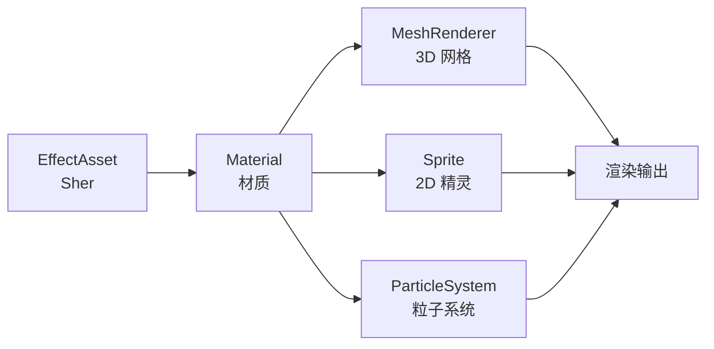

# 材质系统

> [!abstract] 摘要
> 材质（Material）是着色器（EffectAsset）的数据集，封装了纹理贴图、Uniform 参数、宏定义开关等渲染所需数据，并通过属性检查器提供可视化调整能力。材质作为资源可被 MeshRenderer、Sprite、ParticleSystem 等渲染器组件使用，决定了物体表面的最终渲染外观。

## 核心概念

### 材质是什么

材质描述了物体表面与光交互的方式。一个小球是玻璃还是塑料，一个箱子是木头还是铁皮——这些外观差异通过材质来定义。材质是着色器的**数据容器**，着色器定义了渲染流程，材质则为这个流程提供具体参数。



### 核心概念解析

| 概念 | 说明 |
|------|------|
| **Material** | 材质资源，关联一个 EffectAsset，存储 Uniform 值、宏定义状态、管线状态 |
| **EffectAsset** | 着色器资源（.effect 的编译产物），提供属性声明、宏列表、Shader 代码 |
| **Technique** | 渲染技术选择，一个 Effect 可有多个 Technique，材质实例指定使用哪一个 |
| **Pass** | 渲染过程，每个 Technique 含 1 个或多个 Pass，每个 Pass 有独立的属性和宏定义 |
| **共享材质** | 多个渲染器组件共享同一材质实例，修改共享材质影响所有使用者 |
| **材质实例** | 单个渲染器组件独立拥有的材质副本，修改仅影响该组件 |

## 关键细节

### 材质创建方式

#### 编辑器创建

在资源管理器中右键 → **创建 → 材质**，默认使用 `builtin-standard.effect`（PBR 着色器）。

#### 程序化创建

```ts
const mat = new Material();
mat.initialize({
    effectName: 'pipeline/skybox',  // 指定着色器
    technique: 0,                    // 使用第 0 个 Technique（可选）
    defines: {                       // 开启宏定义
        USE_RGBE_CUBEMAP: true
    },
    states: {}                       // 管线状态重载（可选）
});
```

### 材质属性面板

| 属性 | 说明 |
|------|------|
| **Effect** | 当前使用的着色器，默认 `builtin-standard`。切换 Effect 后其他属性同步更新 |
| **Technique** | 选择当前 Effect 中的某个渲染技术 |
| **USE INSTANCING** | 是否启用 GPU Instancing，适合大量相同模型实例 |
| **Pass 列表** | 每个 Pass 有独立的属性和宏定义，可分别配置 |
| **预览模型** | 可在属性检查器右上角切换预览用的模型 |

> [!note] 数据迁移
> 属性检查器会缓存当前材质的用户数据。切换 Effect 或 Technique 时，缓存数据会自动迁移，尽量保持已有设置。

### 共享材质与材质实例

| 类型 | 获取方式 | 影响范围 |
|------|---------|---------|
| 共享材质 | `renderable.getMaterial(0)` 或 `renderable.sharedMaterial` | 所有使用该材质的组件 |
| 材质实例 | `renderable.material`（getter）或 `renderable.getMaterialInstance(0)` | 仅当前组件 |

> [!warning] DrawCall 与材质实例
> 调用 `getMaterialInstance` 或 `renderable.material` 的 getter 会生成新的材质实例，导致无法合批从而增加 DrawCall。修改共享材质时需注意这一点。

### 程序化设置材质属性

```ts
// 通过 Material.setProperty 设置 Uniform
mat.setProperty("uniform name", uniformValue);

// 频繁设置时使用 Pass.setUniform 获得更好性能
const pass = mat.passes[0];
pass.setUniform(pass.getHandle("mainColor"), new Vec4(1, 0, 0, 1));
```

> [!important] 宏定义修改限制
> 材质的预处理宏在初始化完成后便不能直接修改。如需修改，必须使用 `Material.initialize` 或 `Material.reset` 方法。

### 材质在各类渲染器中的使用

| 渲染器 | 设置方式 |
|--------|---------|
| **MeshRenderer** | `Materials` 属性（支持多材质数组）、`setMaterial(mat, index)` |
| **Sprite（2D）** | `Custom Material` 属性、`sprite.customMaterial = mat` |
| **ParticleSystem** | Renderer 组件的 `ParticleMaterial` 和 `TrailMaterial` |
| **从模型导入的材质** | 可在属性检查器中提取材质到指定目录，自动绑定到渲染器 |

### 内置材质

引擎在 `internal/default_materials/` 下提供了常用内置材质：

| 内置材质 | 说明 |
|----------|------|
| `default-material` | 非透明物体的标准 PBR 材质 |
| `default-material-transparent` | 半透明物体的标准 PBR 材质 |
| `particle-add` | 标准粒子叠加材质 |
| `ui-sprite-material` | 精灵（Sprite）标准材质 |

内置材质的属性均不允许修改，需自行创建材质进行自定义。

## 与其他系统的关系

- **[[图形渲染]]**：材质系统是渲染管线中决定物体外观的关键环节，每个可渲染对象必须指定材质
- **[[Shader 系统]]**：Material 由 EffectAsset（Shader 的编译产物）驱动，材质是 Shader 参数的可视化配置层
- **[[资源系统]]**：材质是一种资源类型（Material Asset），受 Asset Manager 管理，支持保存、撤销、重做操作

## 注意事项

> [!warning] 材质界面编辑
> 材质编辑过程中，属性检查器获焦时支持 Ctrl/Cmd+Z（撤销）和 Ctrl/Cmd+Shift+Z（重做）。点击保存后无法重置，修改前建议先复制材质。

> [!tip] 合批优化
> 共享材质可以被多个渲染器合批。如果修改了共享材质中的属性导致生成了材质实例，合批将失效。尽量使用共享材质以优化 DrawCall。

## 相关页面

- [[图形渲染]]
- [[Shader 系统]]

## 原始来源

- [材质系统总览](raw/material-system/overview.md)
- [程序化使用材质](raw/material-system/material-script.md)
- [材质系统类图](raw/material-system/material-structure.md)
- [内置材质](raw/material-system/builtin-material.md)
- [材质资源](raw/asset/material.md)
- [着色器语法](raw/shader/effect-syntax.md)
