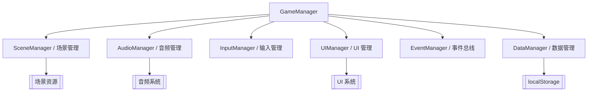

# 游戏开发概述

> [!abstract] 摘要
> 游戏开发是学习链的实践层——它将引擎知识、编程能力和工程方法统合为**做游戏的手艺**。本层不重复引擎文档的功能说明，而是聚焦于：如何组织项目架构？如何让游戏在不同平台上跑得流畅？如何扩展编辑器提升效率？如何管理团队协作和资产管线？这些问题没有"引擎标准答案"，只有经过实践检验的模式和经验。

## 核心定位

在完整的学习链中，游戏开发是最终输出层：

```
Linux → JS → TS → Cocos Creator → 游戏开发
  操作系统    语言       类型系统        引擎          实践
```

- **引擎层**（[[Cocos Creator 概述]]）回答"这个工具能做什么"——提供场景编辑、渲染、物理、动画等功能
- **实践层**（本层）回答"如何用这个工具做出好游戏"——关注架构设计、性能优化、工作流和工程化

游戏开发层的内容主要来自**项目实践经验**和跨领域综合，而非单一源文档。它的价值在于将分散的引擎特性串联成可落地的完整方案。

## 游戏架构模式

### 项目结构设计

一个可维护的游戏项目通常按以下方式组织：

```
assets/
├── scenes/          # 场景文件（菜单、关卡、结算等）
├── prefabs/         # 预制体（玩家、敌人、道具等可复用对象）
├── scripts/         # 脚本（按功能模块分子目录）
│   ├── manager/     # 管理器（GameManager、AudioManager 等）
│   ├── player/      # 玩家相关逻辑
│   ├── enemy/       # 敌人 AI 与行为
│   ├── ui/          # UI 面板脚本
│   └── utils/       # 工具函数
├── resources/       # 动态加载资源（bundle 分包目录）
├── textures/        # 纹理资源
├── animations/      # 动画剪辑
├── audio/           # 音频资源
└── materials/       # 材质资源
```

关键原则：
- **Manager 模式**：核心功能通过单例管理器（持久节点）统一调度，避免脚本间直接耦合
- **Prefab 驱动**：可复用的游戏对象（UI 面板、角色、道具）做成 [[预制资源]]，通过脚本动态实例化
- **场景即关卡**：每个 [[场景资源]] 是独立的游戏阶段，通过 `director.loadScene` 切换

### 核心系统架构

游戏的核心系统通常抽象为独立管理器，注册到 `GameManager` 的生命周期中：



> 这些 Manager 对应的是游戏层面的逻辑抽象，NOT 引擎内置的 [[资源系统]] AssetManager。游戏层 Manager 负责游戏逻辑调度，引擎层 Manager 负责资源加载/释放。

### 常见游戏循环

在 [[引擎架构]] 的更新循环（`update` → `lateUpdate`）之上，游戏层通常叠加自己的状态机：

```
加载界面 → 主菜单 → 游戏中 → 暂停 → 结算 → 主菜单
    ↓         ↓        ↓       ↓      ↓
  Loading  MenuState Gameplay Paused Result
```

每个状态封装为一个独立模块，通过状态管理器切换。[[脚本系统]] 的生命周期回调（`onLoad`、`start`、`update`）提供了实现状态机的钩子。

## 性能优化

性能是游戏开发区别于一般应用开发的核心挑战——游戏必须在每帧 16ms（60fps）或 33ms（30fps）内完成所有计算和渲染。

### 渲染优化

| 策略 | 原理 | 相关系统 |
|------|------|----------|
| **Draw Call 合批** | 将多个使用相同材质/纹理的节点合并为一次渲染调用 | [[图形渲染]]、[[UI 系统]] |
| **纹理图集** | 将小图合并为大图，减少纹理切换次数 | [[精灵帧]]、[[纹理贴图]] |
| **动态合图** | 运行时自动合并小纹理，无需手动制作图集 | [[进阶主题#动态合图]] |
| **LOD 模型** | 远处物体使用低精度模型，降低顶点数 | [[模型资源]] |
| **视锥体剔除** | 不渲染视锥体外的物体 | [[图形渲染]]、[[物理系统]] |
| **遮挡剔除** | 不渲染被其他物体完全遮挡的物体 | [[图形渲染]] |

> 合批是移动端最重要的优化手段之一。[[UI 系统]] 的渲染合批规则（不打断渲染批次的条件）是每个游戏开发者必须掌握的。

### 内存优化

- **对象池**：频繁创建/销毁的对象（子弹、特效、UI 飘字）用对象池复用，避免 GC 抖动
- **资源释放**：利用 [[资源系统]] 的引用计数机制，确保不再使用的资源被正确释放
- **分包加载**：将非核心资源放 `resources` 子包，按需加载而非一次性加载所有资源
- **纹理压缩**：根据平台选择压缩格式（ETC2、ASTC、PVRTC），详见 [[纹理贴图]]

### 逻辑优化

- **空间分区**：对于大量实体的碰撞检测和查找，使用四叉树/八叉树或 [[物理系统]] 的碰撞分组减少检测次数
- **分帧处理**：初始化等重操作分散到多帧执行，避免单帧卡顿
- **LOD 逻辑**：远处敌人使用简化的 AI 逻辑，降低 CPU 开销

## 编辑器扩展与工具链

### 自定义扩展

Cocos Creator 支持通过扩展系统增强编辑器功能：

- **自定义面板**：在编辑器中创建专用工具面板（关卡编辑器、数据表格、自动化脚本面板）
- **自定义 inspector**：为特定组件定制属性检查器面板
- **场景脚本**：编辑器内运行的脚本，用于批量处理场景/资源
- **构建插件**：在 [[发布系统]] 构建流程中插入自定义步骤（资源加密、SDK 注入、包体优化）

### 自动化管线

将重复性工作脚本化是提升效率的关键：

- **资源导入自动化**：监听资源导入事件，自动压缩纹理、设置参数
- **构建流水线**：通过命令行构建 + CI/CD（GitHub Actions、Jenkins）实现自动出包
- **配置检查**：自动校验场景引用、丢失资源、脚本错误等

## 跨平台开发

Cocos Creator 的跨平台能力是其核心卖点之一，但真正做好跨平台需要额外投入。

### 输入适配

不同平台的输入方式差异巨大：

| 平台 | 输入方式 | 关键点 |
|------|---------|--------|
| Web | 鼠标 + 键盘 | 点击精度高，支持悬停态（hover） |
| 移动端 | 单点/多点触摸 | 需要适配 Touch 事件，考虑手指遮挡和误触 |
| 桌面（原生） | 鼠标 + 键盘 + 手柄 | 可能需支持多输入设备同时操作 |

实践中通常会抽象一个统一的输入层（InputManager），屏蔽平台差异，让游戏逻辑只依赖抽象的"确定""取消""移动"等语义动作，而非具体按键或触摸事件。

### 分辨率适配

[[UI 系统]] 的 Canvas 组件提供了多分辨率适配方案（FIXED_WIDTH、FIXED_HEIGHT、SHOW_ALL 等），但游戏场景的 Camera 可视区域也需要适配策略：

- **等比缩放 + 黑边**：固定设计分辨率，保持游戏画面比例不变
- **扩展视野**：竖屏游戏在高宽比设备上显示更多纵向内容
- **安全区**：全面屏设备的刘海和底部指示条区域需要避开

### 性能分级

移动设备的性能差异极大（低端安卓 vs iPhone Pro），需要分级策略：

- **画质设置**：根据设备能力动态调整阴影、粒子数量、后处理效果
- **资源降级**：低端设备使用低精度模型、低分辨率纹理
- **帧率目标**：高端 60fps，低端 30fps 保流畅

### 平台 API 差异

[[进阶主题]] 中的 JSB 桥接是实现平台特定功能的通道（支付、推送、广告等）。跨平台开发时需要为每个平台的 SDK 封装统一接口层。

## 项目工作流

### 版本控制

游戏项目的版本控制比纯代码项目更复杂——包含大量二进制资源（纹理、模型、音频）且频繁变更。

- **Git LFS**：大文件用 LFS 管理，避免仓库膨胀
- **资源与代码分离**：只对 `assets/scripts/` 做版本控制，巨大的资源文件通过其他方式同步
- **引擎版本锁定**：明确记录项目使用的 Cocos Creator 版本，避免编辑器升级导致不可预见的问题

### 团队协作

- **场景拆分**：一个开发者同时操作同一个场景文件极易冲突。按功能模块拆分子场景或通过 Prefab 并行开发
- **命名规范**：统一节点、脚本、资源的命名和目录结构，降低沟通成本
- **文档化**：维护项目 Wiki 记录架构决策、资源规范、构建流程，而非依赖口头传承

### 发布流程

```
开发环境 → 测试构建 → 功能测试 → 回归测试 → 正式构建 → 渠道分发 → 线上监控
```

[[发布系统]] 支持多平台一键构建，但实践中需要为每个平台配置独立的签名、权限、SDK 参数。建议将构建配置文档化并脚本化（命令行构建），确保可复现。

## 常见游戏系统

### 存档系统（Save/Load）

- 使用 `localStorage` 序列化为 JSON 存储（[[进阶主题#数据存储]]）
- 复杂存档需考虑版本兼容——存档格式加 version 字段，升级时做迁移
- 需加密的场景：敏感数据（如单机付费解锁）至少做混淆，服务端存档最安全

### 音频管理

基于 [[音频系统]] 的 AudioSource，封装 AudioManager：

- 区分**背景音乐**（长循环、单通道）和**音效**（短促、多实例、用 `playOneShot`）
- 全局音量控制（主音量/音乐/音效三通道）
- 玩家设置的音频偏好持久化存储

### 本地化

- 使用 [[进阶主题#多语言国际化]] 的 i18n 方案或 v3.6+ 内置 L10N 系统
- 文本、图片（含文字）、音频（语音语言）都需要本地化
- 动态文本需考虑不同语言的文本长度差异对 UI 布局的影响

### 事件系统

Cocos 的 `EventTarget` 和 Node 事件系统提供了基本的事件机制。在游戏层，建议封装全局 EventBus（单例），用于跨模块通信：

- **松耦合**：发送者不需要知道接收者是谁
- **可追踪**：统一管理事件类型常量，方便查找和重构
- **注意内存泄漏**：组件销毁时必须取消事件监听

## 注意事项

> [!warning] 并非所有优化都值得做
> 过早优化是万恶之源。先让游戏跑起来，用 Profiler 定位瓶颈，再定向优化。[[图形渲染]] 的 Draw Call 合批在 draw call < 100 时效果甚微。

> [!warning] 原生平台 ≠ Web 平台
> 热更新、JSB 桥接、本地存储机制在原生平台和 Web 平台差异显著。始终在目标平台上测试，而非仅在浏览器预览。

> [!tip] 优先复用引擎特性
> 很多"自己实现"的需求其实是引擎已有的功能——先查 [[Cocos Creator 概述]] 和相关系统页面，再自己造轮子。

> [!warning] 编辑器版本变化
> Cocos Creator 3.x 仍在活跃开发，API 和编辑器行为可能在小版本间有变化。升级前务必阅读 changelog，在测试环境验证后再升级生产项目。

## 相关页面

### 前提概念（引擎层）

- [[Cocos Creator 概述]] — 引擎整体架构和功能定位
- [[引擎架构]] — ECS 架构、更新循环、子系统关系
- [[场景与节点系统]] — 场景管理、节点树、组件挂载
- [[脚本系统]] — TypeScript 脚本的编写、生命周期、装饰器
- [[资源系统]] — 资源加载、Asset Bundle、引用计数
- [[图形渲染]] — 渲染管线、相机、光照、阴影
- [[物理系统]] — 2D/3D 物理、碰撞检测、刚体
- [[动画系统]] — 动画剪辑、骨骼动画、程序化动画
- [[UI 系统]] — Canvas、多分辨率适配、渲染合批
- [[音频系统]] — AudioSource、Web Audio / DOM Audio 模式
- [[粒子系统]] — 粒子模块化架构、CPU vs GPU 渲染
- [[Shader 系统]] — Cocos Shader、CCEffect/CCProgram
- [[材质系统]] — 材质与着色器的关系、材质实例
- [[缓动系统]] — Tween 链式动画、缓动函数
- [[发布系统]] — 跨平台构建、命令行自动化

### 后续概念（实践层）

- [[预制资源]] — Prefab 创建、编辑与动态实例化
- [[场景资源]] — 场景文件结构与编辑器操作
- [[精灵帧]] — 图集管理与精灵帧引用
- [[纹理贴图]] — 纹理格式、压缩、过滤模式
- [[模型资源]] — 3D 模型导入与配置
- [[进阶主题]] — 引擎定制、热更新、JSB 桥接、数据存储
- [[Cocos Creator vs Unity]] — 引擎对比，理解 Cocos 的工程优劣

### 横向概念（软件工程）

游戏开发大量依赖通用软件工程实践——设计模式（单例、观察者、状态模式）用于游戏架构；测试策略（单元测试/集成测试）保证逻辑正确性；CI/CD 用于自动化构建流水线；代码审查和命名规范保证团队协作质量。这些通用原则在游戏开发场景下有特殊的侧重和变化。

## 原始来源

游戏开发层的知识主要来自**项目实践经验**和跨领域综合，缺少对应的单一 `raw/` 源文档。以下内容为参考基础：

- Cocos Creator 引擎各系统页面的原始来源（见各相关页面）
- [[进阶主题]] 中引用的引擎定制、热更新、JSB 桥接等文档
- 游戏开发通用工程实践（设计模式、性能优化方法论、跨平台适配策略）
