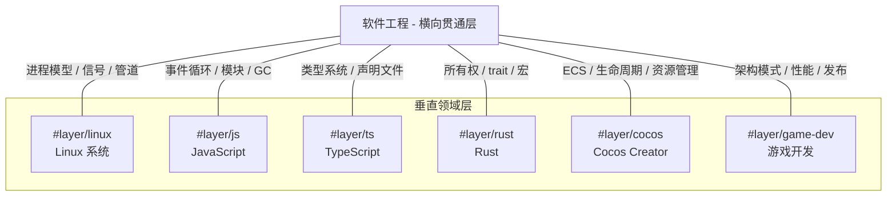
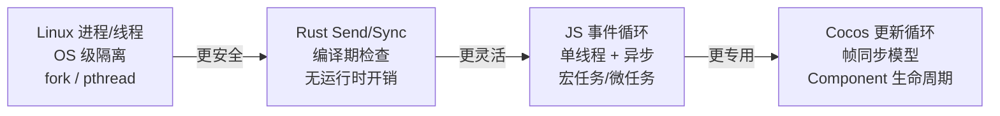

# 软件工程概述

> [!abstract] 摘要
> 软件工程不是另一个独立的知识领域，而是**横向贯通所有技术层的元学科**。它研究的是跨越语言、引擎、操作系统的通用实践——设计模式、测试策略、架构设计、并发模型、内存管理、错误处理、CI/CD——在 JavaScript、TypeScript、Rust、Cocos Creator、Linux 等不同领域中虽有迥异的语法表层，但在本质问题上是相通的。理解这些跨域共鸣，才能在切换技术栈时快速迁移经验，而不是每次都从零开始。

## 横向层的本质

传统技术学习按"层"纵向组织：Linux → JS → TS → Rust → Cocos → 游戏开发。每层有自己的语言、工具和范式，看起来互不隶属。但当你跨层转移时会发现一些模式反复出现：

- 「Observer 模式」在 JS 中是 `addEventListener`，在 Cocos 中是 `EventTarget`，在 Linux 中是 `signal()`——同一个思想，不同的语法壳
- 「模块化」在 JS 中是 ES6 `import/export`，在 Rust 中是 `mod` + `crate`，在 Linux 中是内核模块（`.ko`）——同一个问题："如何将大系统拆成可维护的小单元"
- 「并发安全」在 Rust 中是 `Send`/`Sync` trait（编译期），在 JS 中是单线程事件循环（运行时），在 Linux 中是进程隔离（OS 级）——同一个目标：防止数据竞争

**[[软件工程概述|软件工程]]作为横向层，研究的就是这些"同一个思想"在不同领域的表现形式**。它不是让你每学一个新技术就从零开始，而是帮你识别：这个新技术里的 X，其实就相当于你已知的 Y。

> [!tip] 关键认知
> **软件工程不是"第七层"，而是跟所有层都正交的一刀横切**。就像腌黄瓜不是一道新菜，而是切法——同样的黄瓜，横切和竖切看到的截面完全不同。SWE 是横向切法，让你看到各领域技术表象之下共享的结构性模式。

## 核心概念域

以下七大概念域是 SWE 横向贯通的枢纽。每个域在不同技术层中有不同的实现方式，但底层问题相同。

### 设计模式

设计模式是应对常见软件设计问题的可复用方案。"Observer 模式"在不同领域中的形态：

| 领域 | Observer 实现 | 特点 |
|------|--------------|------|
| **JS** | `addEventListener` / `EventTarget` | 浏览器原生，支持冒泡/捕获/委托传播（见 [[JavaScript 事件]]） |
| **Cocos** | `node.on()` / `EventTarget` | 引擎内建事件系统，用于节点通信和引擎事件 |
| **Linux** | `signal(SIGINT, handler)` / `sigaction` | OS 级信号机制，异步通知进程状态变化 |
| **Rust** | trait object + callback / `tokio::sync::watch` | 通过 trait 约束实现类型安全的观察者；异步版本用 channel 广播 |

> 同样的 Observer 思想，JS 侧重 DOM 树传播，Cocos 侧重引擎事件通知，Linux 侧重进程间信号，Rust 侧重类型安全。理解模式本质后，跨域迁移只需学习新语法，无需重新理解模式。

其他跨域模式共鸣：

| 模式 | JS/TS 实现 | Rust 实现 | Cocos 实现 | Linux 体现 |
|------|-----------|-----------|------------|-----------|
| **Singleton** | 模块级 `const`（模块单次执行） | `OnceLock` / `lazy_static` | `Director.getInstance()` | systemd service instance |
| **Factory** | 构造函数 + 工厂函数 | `new()` / Builder 模式 | `Node.addComponent()` | udev 设备节点创建 |
| **Command** | 闭包 / 命令对象 | enum 命令模式 | 编辑器 Undo/Redo 动作 | shell 管道：`cmd1 \| cmd2` |
| **Decorator** | 函数装饰器 / Proxy | Wrapper 类型 / `Deref` trait | `@ccclass` / `@property` | systemd unit override 文件 |

> [!note] 模式 ≠ 模板
> 设计模式不是代码模板——它是**意图 + 结构 + 后果**的三元组。同一个 Observer，在 JS 中因为 DOM API 的约束自然用了 `addEventListener` 的 API 形状，在 Rust 中因为类型安全的要求自然用了 trait bound。模式不变，表达受语言特性约束而自然不同。

### 测试策略

测试的三层金字塔（单元 → 集成 → E2E）在各领域中的具体工具和形态：

| 层次 | JS/TS 生态 | Rust 生态 | Cocos Creator | Linux 系统 |
|------|-----------|-----------|---------------|------------|
| **单元测试** | Mocha + Chai（见 [[JavaScript 代码质量]]） | `cargo test` + `#[test]` 属性 | 脚本单元测试（模拟引擎环境） | Shell 脚本自测 |
| **集成测试** | Supertest（HTTP）、Enzyme（React） | `tests/` 目录集成测试 | 编辑器模拟器预览（组件交互验证） | 内核自测框架（kselftest） |
| **E2E 测试** | Puppeteer / Playwright | 外部测试框架 | 真机多平台测试（见 [[发布系统]]） | 系统集成测试（LTP） |

核心原则（跨域通用）：
- **金字塔比例**：大量单元测试（快速、稳定）→ 适量集成测试 → 少量 E2E（慢、脆弱）
- **行为驱动（BDD）**：`describe` / `it` 结构（Mocha）≈ `#[cfg(test)] mod tests`（Rust），本质都是"场景描述 + 断言验证"
- **Mock/Stub**：隔离外部依赖。JS 用 Sinon，Rust 用 `#[cfg(test)]` 条件编译 + mockall crate

### 架构模式

不同架构范式的本质和跨域对应：

| 范式 | 核心思想 | 跨域表现 |
|------|---------|----------|
| **ECS / 组件式** | 组合优于继承，数据与行为分离 | Cocos Creator 核心架构（见 [[引擎架构]]），Unity ECS，Rust ECS 库（bevy） |
| **管道-过滤器** | 数据流经独立处理阶段，松耦合 | Unix Pipeline：`grep \| sort \| uniq`；JS Stream API；React 中间件链 |
| **事件驱动** | 组件通过事件总线通信，解耦发送方与接收方 | JS DOM 事件（[[JavaScript 事件]]）；Cocos 引擎事件；Linux 信号；Rust channel |
| **模块系统** | 代码按功能边界分离，控制可见性 | JS ES6 模块（[[JavaScript 模块]]）；Rust crate 系统；Linux 内核模块；TS 声明文件 |

> ![important] 核心洞察
> 模块化是几乎所有非平凡软件系统的基础组织原则。Rust 的 crate、JS 的 `import`、Linux 的 LKM——表象不同，但都解决了同一个根本问题：**如何将大型系统拆分为可独立开发、测试、替换的单元**。各系统的差异只在于边界粒度（函数/文件/crate/服务）和可见性控制（`pub` / `export` / `EXPORT_SYMBOL`）。

### 并发模型

不同层级的并发安全保障机制，形成了从 OS 到编译期到运行时的完整光谱：

| 并发模型 | 安全机制 | 开销 | 典型场景 |
|----------|---------|------|---------|
| **Linux 进程** | 虚拟内存隔离，进程间不共享地址空间 | 高（上下文切换 + IPC） | 系统服务、容器化 |
| **Linux 线程** | 共享地址空间，需手动同步（mutex/semaphore） | 中（锁争用） | 高性能服务端 |
| **Rust Send/Sync** | 编译期所有权 + trait 约束，拒绝数据竞争 | **零**运行时开销 | 系统编程、高性能计算 |
| **JS 事件循环** | 单线程 + 异步任务队列（见 [[JavaScript Promise 与异步]]） | 无锁开销，但阻塞主线程会卡 UI | 浏览器交互、Node.js IO |
| **Cocos 更新循环** | 帧同步 + 组件生命周期回调 | 引擎调度开销 | 游戏逻辑、实时渲染 |

> 每个模型代表了安全性和性能的不同权衡点。理解这些模型有助于在技术选型时做出正确决策，也帮助理解为什么 JS 中不能像 Rust 那样"放心地"在多个线程间共享数据。

### 内存管理

从硬件到语言的完整内存管理光谱：

| 层级 | 机制 | 安全保证 | 代表 |
|------|------|---------|------|
| **OS 层** | 虚拟内存 + 页表 + MMU | 进程隔离（地址空间隔离） | Linux 内核 |
| **编译期** | 所有权 + 借用检查 + 生命周期标注 | 无 use-after-free / double free / 数据竞争 | Rust |
| **运行时** | 引用计数 + 标记清除 GC | 自动回收，无悬垂指针 | JS（V8 分代 GC） |
| **应用层** | 引用计数 + 手动加载/释放 | 由 Asset Manager 管理生命周期 | Cocos Creator 资源系统（见 [[资源系统]]） |

核心问题相同——**谁拥有这块内存？什么时候释放？**——但解法不同：
- Linux：由 OS 内核通过页表映射和虚拟地址空间管理
- Rust：由编译器通过所有权规则在编译期静态推导
- JS：由 GC 在运行时追踪和回收
- Cocos：由引擎的 Asset Manager 以引用计数手动管理

> [!warning] 跨层理解关键
> Rust 的所有权系统之所以不需要 GC，根本原因在于它**把"谁拥有内存"的问题从运行时提前到了编译期**。理解了这个，你就能理解为什么 Rust 不需要 GC 却依然内存安全——它用编译期检查替代了运行时追踪。

### 错误处理

各领域的错误处理哲学对比：

| 领域 | 机制 | 哲学 | 强制处理？ |
|------|------|------|-----------|
| **JS** | `try-catch`（见 [[JavaScript 错误处理]]）、Promise rejection | 运行时捕获，可选处理 | 否（unhandledrejection 是运行时事件） |
| **TS** | 同上（TS 不改变 JS 运行时错误模型） | 类型层面标注可能为 `null/undefined` | 部分（strictNullChecks） |
| **Rust** | `Result<T, E>` / `Option<T>` + `?` 运算符 | 错误即值，通过类型系统强制显式处理 | **是**（编译器强制） |
| **Cocos** | `try-catch` + 引擎错误事件 | 脚本层捕获 + 引擎层事件通知 | 否 |
| **Linux** | `errno` + 返回值 / 信号 | 错误通过返回值传递，信号用于异常通知 | 否（但忽略返回值常导致 bug） |

> [!conflict] 错误处理哲学分歧
> Rust 的 `Result<T, E>` 和 JS 的 `try-catch` 代表了两种根本不同的错误处理哲学：**错误即值** vs **错误即控制流**。Rust 把错误作为函数的返回类型之一，编译器强制调用者处理；JS 把错误作为运行时抛出的异常，调用者可以选择性捕获。两种哲学各有优劣——强制处理更安全但更繁琐，可选捕获更灵活但容易遗漏。

### 工具链与 CI/CD

开发工具链在不同领域的对应关系：

| 环节 | JS/TS | Rust | Cocos Creator | Linux |
|------|-------|------|---------------|-------|
| **版本控制** | [[Git 与版本控制]] / [[Jujutsu VCS]] | 同左 | 同左 | 同左 |
| **包管理** | npm / yarn / pnpm | Cargo / crates.io | 编辑器内置扩展商店 | pacman / apt |
| **构建** | webpack / rollup / tsc | cargo build | Cocos 内置构建面板（见 [[发布系统]]） | make / CMake |
| **Lint** | ESLint | clippy（`cargo clippy`） | 编辑器内建 Lint | shellcheck |
| **格式化** | Prettier | rustfmt | 编辑器内建格式化 | shfmt |
| **CI 管道** | GitHub Actions（调度 ≈ cron） | 同左 | 命令行构建 + CI（见 [[发布系统]]） | systemd timer ≈ cron |

> [!tip] 概念共鸣
> - GitHub Actions 的 `schedule` 触发 ≈ Linux `cron` ≈ systemd timer
> - Docker Compose 的 `depends_on` ≈ systemd unit 的 `After=/Requires=`
> - npm 的 `devDependencies` ≈ Rust 的 `[dev-dependencies]`
> - `.gitignore` ≈ `.npmignore` ≈ Cargo `exclude`

## 概念导航

以下是软件工程层的页面规划。标记 "#TODO" 的为待创建页面。

### 现有页面

| 页面 | 摘要 | 标签 |
|------|------|------|
| [[软件工程概述]] | 横向层入口，跨域 SWE 模式综合 | `#layer/sw-eng` `#type/overview` |
| [[引擎架构]] | ECS / 组件式架构在 Cocos 中的实现 | `#layer/cocos` `#type/overview` |
| [[JavaScript 代码质量]] | 调试、编码风格、BDD 测试（Mocha/Chai） | `#layer/js` `#type/concept` |
| [[JavaScript 事件]] | Observer 模式在 DOM 中的实现 | `#layer/js` `#type/concept` |
| [[JavaScript Promise 与异步]] | 异步编程模型：Promise / async-await | `#layer/js` `#type/concept` |
| [[JavaScript 模块]] | ES6 模块系统 | `#layer/js` `#type/concept` |
| [[JavaScript 错误处理]] | try-catch / Promise rejection | `#layer/js` `#type/concept` |
| [[Git 与版本控制]] | Git 版本控制基础 | `#layer/tool` `#type/concept` |
| [[Jujutsu VCS]] | Jujutsu 分布式版本控制系统 | `#layer/tool` `#type/concept` |
| [[发布系统]] | Cocos 跨平台构建发布 | `#layer/cocos` `#type/concept` |
| [[进阶主题]] | 引擎定制、热更新、JSB 桥接 | `#layer/cocos` `#type/concept` |

### 待创建

| 页面 | 摘要 | 跨域连接 |
|------|------|----------|
| 设计模式：观察者 | Observer 模式的跨语言实现对比 | JS 事件 ↔ Cocos 事件 ↔ Linux 信号 |
| 测试策略 | 测试金字塔的跨域统一视图 | JS Mocha ↔ Rust cargo test ↔ Cocos 真机测试 |
| 架构模式对比 | ECS vs 管道-过滤器 vs 事件驱动 | Cocos ECS ↔ Unix 管道 ↔ JS 事件系统 |
| 并发模型全景 | 从 OS 进程到事件循环的完整光谱 | Linux 进程 ↔ Rust Send/Sync ↔ JS 事件循环 |
| 内存管理全景 | 从虚拟内存到 GC 的完整光谱 | Linux 页表 ↔ Rust 所有权 ↔ JS GC |
| 错误处理哲学 | 错误即值 vs 错误即控制流 | Rust Result ↔ JS try-catch |
| CI/CD 实践 | 自动化构建/测试/部署的跨域实践 | GitHub Actions ↔ systemd timer ↔ Cocos 命令行构建 |
| 模块化设计 | 模块系统的跨语言对比 | Rust crate ↔ JS ES6 ↔ Linux LKM |
| 代码审查 | 代码审查的原则与实践 | 跨所有领域通用 |
| 技术债务管理 | 技术债务的识别与偿还策略 | 跨所有领域通用 |

## 学习路径建议

不同背景的开发者切入 SWE 横向层的建议路径：

- **JS/TS 开发者**：从 [[JavaScript 代码质量]]（测试）、[[JavaScript Promise 与异步]]（异步模式）出发，通过本页的跨域对比表逐步理解 Rust 的所有权和并发模型
- **Cocos 开发者**：从 [[引擎架构]]（ECS）出发，将组件式思想扩展到其他领域；从 [[发布系统]] 理解 CI/CD 概念
- **系统编程学习者**：将 Rust 的所有权和错误处理模型与 JS 对比，理解"编译期保证"的概念边界
- **通用路径**：无论从哪开始，Git（[[Git 与版本控制]] / [[Jujutsu VCS]]）是最基础的横向工具，应优先掌握

## 相关页面

- [[引擎架构]] — ECS 架构详解（组件式设计在游戏引擎中的典范实现）
- [[JavaScript 代码质量]] — JS 中的测试策略（BDD / Mocha + Chai）
- [[JavaScript Promise 与异步]] — JS 异步编程模型（事件循环 + 微任务）
- [[JavaScript 事件]] — JS 中的 Observer 模式实现（DOM 事件系统）
- [[JavaScript 模块]] — JS 模块化系统（ES6 模块）
- [[JavaScript 错误处理]] — JS 中的错误处理机制（try-catch / Promise）
- [[Git 与版本控制]] — 版本控制基础
- [[Jujutsu VCS]] — 现代版本控制工具
- [[发布系统]] — Cocos 跨平台构建与发布（CI/CD 在游戏领域实践）
- [[进阶主题]] — 引擎定制、热更新、JSB 原生桥接
- [[Cocos Creator 概述]] — Cocos 引擎入口
- [[JavaScript 教程概述]] — JS 教程入口

## 原始来源

软件工程概念来自横向综合，非单一源文档。本页面的分析源自对以下领域的跨域模式识别：

- JavaScript 领域：`raw/zh.javascript.info/`（[[JavaScript 教程概述]]）
- Cocos Creator 领域：`raw/` 顶层各子系统目录（[[Cocos Creator 概述]]）
- 版本控制实践：本仓库使用 [[Jujutsu VCS]] + Git
- 软件工程通用知识：设计模式（GoF）、测试金字塔、CI/CD 最佳实践等经典 SWE 文献

> [!note] 横向层特点
> SWE 层不绑定于任何单一 `raw/` 源文档。它的知识来源是"跨所有领域的模式归纳 + 经典软件工程文献"。每个 SWE 概念页面的价值恰恰在于**展示同一模式在不同领域中的不同实现**——这种跨域视角是单领域页面无法提供的。
